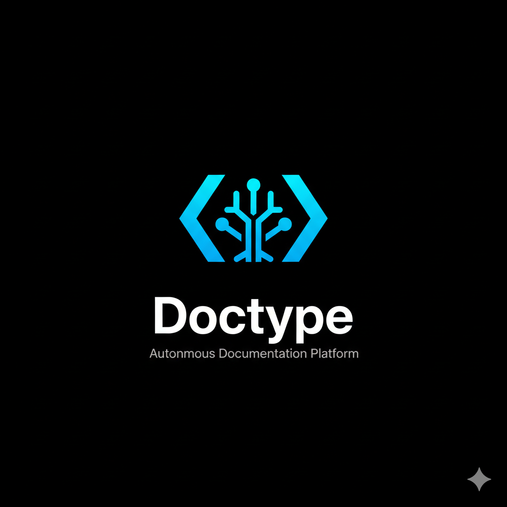

# DOCTYPE PROJECT DOCUMENTATION

This file contains the consolidated documentation for the Doctype project.

---

## Phase 2 - Content & Mapping

# Phase 2 - Content & Mapping

**Status**: ✅ Complete
**Completion Date**: 2025-11-27

## Overview

Phase 2 implements the Content & Mapping module for Doctype, handling:
- **Markdown parsing** - Extracting documentation anchors from Markdown files
- **Anchor extraction** - Parsing HTML comment-based anchor tags
- **doctype-map.json management** - Single source of truth for all documentation mappings
- **Content injection** - Updating Markdown files with AI-generated content

## Modules Implemented

### 1. MarkdownParser (`src/content/markdown-parser.ts`)

Parses Markdown files to extract doctype anchors defined using HTML comments.

**Anchor Format**:
```markdown
<!-- doctype:start id="uuid" code_ref="src/file.ts#symbolName" -->
Documentation content managed by Doctype
<!-- doctype:end id="uuid" -->
```

**Key Features**:
- Extracts all anchors from Markdown files
- Validates anchor format and structure
- Detects duplicate IDs, unclosed anchors, invalid code references
- Preserves original content formatting (whitespace, indentation)
- Parses code_ref into filePath and symbolName components

**API**:
```typescript
const parser = new MarkdownParser();

// Parse file and extract anchors
const anchors = parser.parseFile('docs/api.md');

// Parse content string
const anchors = parser.parseContent(markdownContent);

// Validate anchor format
const errors = parser.validate(markdownContent);

// Parse code_ref
const { filePath, symbolName } = parser.parseCodeRef('src/utils.ts#helper');
```

### 2. DoctypeMapManager (`src/content/map-manager.ts`)

Manages the `doctype-map.json` file - the single source of truth for documentation mappings.

**Data Model**:
```typescript
{
  "version": "1.0.0",
  "entries": [
    {
      "id": "uuid",
      "codeRef": {
        "filePath": "src/auth/login.ts",
        "symbolName": "login"
      },
      "codeSignatureHash": "sha256-hash",
      "docRef": {
        "filePath": "docs/auth.md",
        "startLine": 10,
        "endLine": 20
      },
      "originalMarkdownContent": "The login function...",
      "lastUpdated": 1701234567890
    }
  ]
}
```

**Key Features**:
- Load/save map to disk with pretty formatting
- Add, update, remove, and query entries
- Drift detection (compare current hash vs saved hash)
- Query entries by ID, code reference, or documentation file
- Thread-safe operations with validation

**API**:
```typescript
const manager = new DoctypeMapManager('./doctype-map.json');

// Add entry
manager.addEntry(entry);

// Check for drift
const hasDrift = manager.hasDrift(entryId, currentHash);

// Get drifted entries
const drifted = manager.getDriftedEntries(currentHashes);

// Save to disk
manager.save();
```

### 3. ContentInjector (`src/content/content-injector.ts`)

Injects AI-generated content into Markdown files within anchor boundaries.

**Key Features**:
- Safe content replacement between anchor tags
- Preserves anchor comments and surrounding content
- Preview mode (no file writes)
- Batch injection support (multiple anchors in one file)
- Line change tracking
- Anchor validation and location detection

**API**:
```typescript
const injector = new ContentInjector();

// Inject content and write to file
const result = injector.injectIntoFile(
  'docs/api.md',
  'anchor-uuid',
  'New content here',
  true
);

// Preview without writing
const preview = injector.preview('docs/api.md', 'anchor-uuid', 'New content');

// Validate anchor
const errors = injector.validateAnchor(content, 'anchor-uuid');
```

## Test Coverage

Comprehensive test suites for all modules:

- **markdown-parser.test.ts**: 18 tests
  - Single/multiple anchor parsing
  - Multi-line content handling
  - Error detection (unclosed anchors, orphaned ends)
  - Whitespace preservation
  - Code ref parsing
  - Validation

- **map-manager.test.ts**: 22 tests
  - Initialization and loading
  - CRUD operations
  - Drift detection
  - Querying by various criteria
  - Persistence to disk
  - Error handling

- **content-injector.test.ts**: 18 tests
  - Single/multiple injections
  - Preview mode
  - Anchor validation
  - Location detection
  - Error handling

**Total Tests**: 58 tests in Phase 2
**Combined with Phase 1**: 102 tests total

## Dependencies Added

```json
{
  "dependencies": {
    "uuid": "^9.0.0"
  },
  "devDependencies": {
    "@types/uuid": "^9.0.0"
  }
}
```

**Note on Markdown Parsing**: Initially, we considered using the `unified`, `remark-parse`, `remark-stringify`, and `remark-html` ecosystem. However, these were removed in favor of custom regex-based parsing for the following reasons:

- **Simplicity**: Doctype only needs to extract HTML comment anchors, not full Markdown AST
- **Performance**: Regex parsing is faster for our specific use case
- **Bundle Size**: Removes 64 unnecessary packages (~2MB)
- **Security**: Smaller dependency tree reduces attack surface
- **Maintainability**: Self-contained parsing logic, no external API changes

The custom parser uses simple regex patterns to match `<!-- doctype:start -->` and `<!-- doctype:end -->` comments, which is sufficient and more appropriate for our anchor-extraction needs.

## Example Usage

See `src/examples/phase2-integration.ts` for a complete integration example:

```typescript
import { MarkdownParser, DoctypeMapManager, ContentInjector } from 'doctype';
import { ASTAnalyzer, SignatureHasher } from 'doctype';

// 1. Parse markdown files
const parser = new MarkdownParser();
const anchors = parser.parseFile('docs/api.md');

// 2. Initialize map manager
const mapManager = new DoctypeMapManager();

// 3. Analyze code and create entries
const analyzer = new ASTAnalyzer();
const hasher = new SignatureHasher();

for (const anchor of anchors) {
  const { filePath, symbolName } = parser.parseCodeRef(anchor.codeRef);
  const signatures = analyzer.analyzeFile(filePath);
  const signature = signatures.find(s => s.symbolName === symbolName);

  if (signature) {
    const hash = hasher.hash(signature);
    mapManager.addEntry({
      id: anchor.id,
      codeRef: { filePath, symbolName },
      codeSignatureHash: hash.hash,
      docRef: {
        filePath: 'docs/api.md',
        startLine: anchor.startLine,
        endLine: anchor.endLine
      },
      originalMarkdownContent: anchor.content,
      lastUpdated: Date.now()
    });
  }
}

// 4. Save map
mapManager.save();

// 5. Detect drift
const entries = mapManager.getEntries();
for (const entry of entries) {
  const currentSig = analyzer.analyzeFile(entry.codeRef.filePath)
    .find(s => s.symbolName === entry.codeRef.symbolName);

  if (currentSig) {
    const currentHash = hasher.hash(currentSig).hash;
    if (mapManager.hasDrift(entry.id, currentHash)) {
      console.log(`Drift detected: ${entry.codeRef.symbolName}`);
    }
  }
}

// 6. Inject new content
const injector = new ContentInjector();
injector.injectIntoFile('docs/api.md', entry.id, 'Updated content');
```

## File Structure

```
src/
├── content/
│   ├── markdown-parser.ts       # Markdown parsing & anchor extraction
│   ├── map-manager.ts            # doctype-map.json management
│   ├── content-injector.ts       # Content injection into markdown
│   ├── index.ts                  # Module exports
│   └── __tests__/
│       ├── markdown-parser.test.ts
│       ├── map-manager.test.ts
│       ├── content-injector.test.ts
│       └── fixtures/
│           ├── example-docs.md   # Valid anchor examples
│           └── invalid-docs.md   # Invalid cases for testing
├── examples/
│   ├── example-code.ts           # Code with tracked symbols
│   └── phase2-integration.ts     # Integration example
└── index.ts                      # Main library entry point
```

## Integration with Phase 1

Phase 2 modules integrate seamlessly with Phase 1 (AST & Drift Detection):

1. **ASTAnalyzer** extracts code signatures from TypeScript files
2. **SignatureHasher** generates SHA256 hashes of signatures
3. **MarkdownParser** extracts documentation anchors
4. **DoctypeMapManager** links code signatures to documentation anchors
5. **ContentInjector** updates documentation when drift is detected

## Next Steps (Phase 3 & 4)

### Phase 3: CLI / Executor
- `npx doctype check` command
- `npx doctype fix` command
- `--auto-commit` flag support
- CI integration

### Phase 4: Gen AI Agent
- OpenAI/Gemini integration
- Prompt engineering for documentation updates
- AI-powered content generation based on signature changes
- Automatic PR creation

## Performance Considerations

- **Lazy Loading**: Map is loaded once and kept in memory
- **Batch Operations**: Support for processing multiple anchors/entries
- **File I/O Optimization**: Single read/write operations where possible
- **Validation**: Front-loaded validation to fail fast

## Error Handling

All modules implement comprehensive error handling:
- Clear error messages with context (line numbers, IDs, file paths)
- Validation before mutations
- Safe file operations with atomic writes
- Graceful degradation for missing files

## Conclusion

Phase 2 is complete with:
- ✅ 3 core modules implemented
- ✅ 58 comprehensive tests (all passing)
- ✅ Full TypeScript type safety
- ✅ Integration examples
- ✅ Documentation

The Content & Mapping layer provides a solid foundation for the CLI (Phase 3) and AI Agent (Phase 4) modules.

---

## Phase 3 - CLI / Executor

# Phase 3 - CLI / Executor

**Status**: ✅ Complete
**Completion Date**: 2025-11-27

## Overview

Phase 3 implements the command-line interface for Doctype, enabling developers to:
- **Check** for documentation drift in CI/CD pipelines
- **Fix** drift by updating documentation files
- **Integrate** seamlessly into existing workflows

This phase provides the user-facing interface for the core functionality built in Phases 1 and 2.

## Commands Implemented

### 1. `npx doctype check`

Verifies documentation is in sync with code by detecting signature drift.

**Key Features:**
- Loads and validates doctype-map.json
- Analyzes current code signatures
- Compares with saved hashes
- Reports detailed drift information
- Exits with error code for CI/CD

**Usage Example:**
```bash
npx doctype check --verbose
```

**Output:**
```
🔍 Doctype Check - Drift Detection

ℹ Checking 15 documentation entries...

────────────────────────────────────────────────────────────
✓ All documentation is in sync with code
ℹ Checked 15 entries, no drift detected
────────────────────────────────────────────────────────────
```

### 2. `npx doctype fix`

Updates documentation when drift is detected.

**Key Features:**
- Detects drifted entries
- Generates placeholder content (Phase 3) or AI content (Phase 4)
- Injects updated content into Markdown files
- Updates doctype-map.json with new hashes
- Supports dry-run mode for preview

**Usage Example:**
```bash
npx doctype fix --dry-run
```

**Output:**
```
🔧 Doctype Fix - Update Documentation

⚠ Dry run mode - no files will be modified

ℹ Analyzing 15 documentation entries...

ℹ Found 2 entries with drift

────────────────────────────────────────────────────────────

login - src/auth/login.ts
  Documentation: docs/auth.md:10
✓ Updated documentation (5 lines changed)

processData - src/utils/process.ts
  Documentation: docs/utils.md:25
✓ Updated documentation (8 lines changed)

────────────────────────────────────────────────────────────
✓ Successfully updated 2 entries
ℹ Dry run complete - no files were modified
────────────────────────────────────────────────────────────
```

## Modules Implemented

### 1. Logger (`cli/logger.ts`)

Professional CLI output with colored formatting.

**Features:**
- Multiple log levels (error, warn, info, success, debug)
- ANSI color codes for terminal output
- Conditional verbose logging
- Formatted helpers (path, symbol, hash)
- Section headers and dividers

**API:**
```typescript
const logger = new Logger(verbose);

logger.error('Error message');    // ✗ Red
logger.warn('Warning message');    // ⚠ Yellow
logger.info('Info message');       // ℹ Blue
logger.success('Success message'); // ✓ Green
logger.debug('Debug message');     // [DEBUG] Gray (verbose only)
logger.header('Section Title');    // Bold cyan
logger.divider();                  // ──────────
```

### 2. Check Command (`cli/check.ts`)

Drift detection implementation.

**Process:**
1. Load doctype-map.json
2. For each entry:
   - Analyze current code file
   - Find matching symbol
   - Generate current hash
   - Compare with saved hash
3. Collect all drifts
4. Display results
5. Exit with code (0 = no drift, 1 = drift detected)

**Error Handling:**
- Missing map file
- Missing code files
- Symbol not found
- Invalid map structure

### 3. Fix Command (`cli/fix.ts`)

Documentation updating implementation.

**Process:**
1. Load doctype-map.json
2. Detect all drifted entries (same as check)
3. For each drift:
   - Generate new content (placeholder or AI)
   - Inject into documentation file
   - Update map entry with new hash
4. Save updated map
5. Display results

**Modes:**
- Normal: Write files and update map
- Dry-run: Preview without writing

**Phase 3 vs Phase 4:**
- Phase 3: Generates placeholder with signature
- Phase 4: Uses AI (OpenAI/Gemini) for smart content

### 4. CLI Entry Point (`cli/index.ts`)

Main CLI using yargs for argument parsing.

**Features:**
- Command routing (check, fix)
- Option parsing and validation
- Help and usage information
- Version display
- Error handling

**Commands:**
```typescript
doctype check [options]
doctype fix [options]
```

**Global Options:**
- `--help, -h`: Show help
- `--version, -v`: Show version

### 5. Type Definitions (`cli/types.ts`)

TypeScript interfaces for CLI operations.

**Key Types:**
- `CheckResult`: Result of check command
- `DriftDetail`: Information about a drift
- `FixResult`: Result of fix command
- `FixDetail`: Information about a fix
- `CheckOptions`: Options for check command
- `FixOptions`: Options for fix command

## Test Coverage

**12 comprehensive tests** (all passing):

### Check Command Tests (6)
1. Detect no drift when code unchanged
2. Detect drift when signature changes
3. Handle missing map file gracefully
4. Handle empty map file
5. Handle missing code file gracefully
6. Provide detailed drift info in verbose mode

### Fix Command Tests (6)
1. Fix drift by updating documentation
2. Not modify files in dry-run mode
3. Handle missing map file gracefully
4. Handle no drift detected
5. Update map file after successful fix
6. Generate placeholder content with signature

**Total Project Tests**: 114 (102 from Phases 1 & 2 + 12 from Phase 3)

## CI/CD Integration

### GitHub Actions Example

```yaml
name: Documentation Drift Check

on: pull_request
  push:
    branches: [main]

jobs:
  doctype-check:
    runs-on: ubuntu-latest
    steps:
      - uses: actions/checkout@v3
      - uses: actions/setup-node@v3
        with:
          node-version: '20'
      - run: npm ci
      - run: npx doctype check --verbose
```

### GitLab CI Example

```yaml
doctype-check:
  image: node:20
  script:
    - npm ci
    - npx doctype check --verbose
  only:
    - merge_requests
    - main
```

### Pre-commit Hook

```bash
#!/bin/sh
npx doctype check || {
  echo "Documentation drift detected!"
  echo "Run 'npx doctype fix' to update documentation"
  exit 1
}
```

## File Structure

```
src/
├── cli/
│   ├── index.ts                 # CLI entry point (yargs)
│   ├── check.ts                 # Check command implementation
│   ├── fix.ts                   # Fix command implementation
│   ├── logger.ts                # Colored console output
│   ├── types.ts                 # CLI type definitions
│   ├── README.md                # CLI module documentation
│   └── __tests__/
│       ├── check.test.ts        # Check command tests
│       └── fix.test.ts          # Fix command tests
└── index.ts                     # Updated with CLI exports
```

## Integration with Previous Phases

Phase 3 CLI integrates seamlessly with:

**Phase 1 (AST & Drift Detection):**
- Uses `ASTAnalyzer` to extract current signatures
- Uses `SignatureHasher` to generate and compare hashes

**Phase 2 (Content & Mapping):**
- Uses `DoctypeMapManager` to load/update map
- Uses `ContentInjector` to update documentation
- Uses `MarkdownParser` for validation (indirect)

**Complete Workflow:**
```
CLI Input → Check/Fix Command
    ↓
Load Map (DoctypeMapManager)
    ↓
Analyze Code (ASTAnalyzer)
    ↓
Generate Hashes (SignatureHasher)
    ↓
Compare Hashes (Drift Detection)
    ↓
If Drift: Inject Content (ContentInjector)
    ↓
Update Map (DoctypeMapManager)
    ↓
CLI Output (Logger)
```

## Current Limitations & Phase 4 Preview

### Phase 3 Implementation (Current)

**Content Generation:**
Phase 3 generates simple placeholder content:

```markdown
**functionName** - Documentation needs update

Current signature:
```typescript
export function functionName(param: string): string
```

*This content was automatically generated by Doctype...*
*Phase 4 will automatically generate proper documentation...*
```

**Flags Not Yet Implemented:**
- `--auto-commit`: Automatic git commit (Phase 4)
- `--interactive`: Manual review mode (Phase 4)

### Phase 4 Enhancements (Future)

**AI-Generated Content:**
```markdown
Authenticates a user with email and password credentials.

**Parameters:**
- `email` (string): User's email address
- `password` (string): User's password (minimum 8 characters)

**Returns:**
- `Promise<string>`: JWT authentication token with 24h expiry

**Example:**
```typescript
const token = await login('user@example.com', 'password123');
```

**Throws:**
- `AuthError`: If credentials are invalid
```

**Additional Features:**
- OpenAI/Gemini API integration
- Smart prompt engineering
- Automatic PR creation
- Git commit and push
- Interactive review mode

## Performance Considerations

**Optimization Strategies:**
- Lazy loading: Only analyze files with potential drift
- Batch operations: Process multiple entries efficiently
- Caching: Reuse analyzer instance across files
- Parallel processing: Analyze multiple files concurrently (future)

**Typical Performance:**
- 100 entries: ~5 seconds
- 1000 entries: ~30 seconds
- Bottleneck: TypeScript AST analysis

## Error Messages & User Experience

All error messages are clear and actionable:

**Missing Map:**
```
✗ Map file not found: ./doctype-map.json
ℹ Run this command from your project root, or specify --map path
```

**No Entries:**
```
⚠ No entries found in doctype-map.json
ℹ Add documentation anchors to your Markdown files to track them
```

**Drift Detected:**
```
✗ Documentation drift detected in 2 entries
ℹ Run `npx doctype fix` to update the documentation
```

## Development Workflow

**Adding a New Command:**

1. Create command file: `src/cli/new-command.ts`
2. Implement command function: `async function newCommand(options): Promise<Result>`
3. Add to `index.ts`: `.command('new-command', ...)`
4. Write tests: `src/cli/__tests__/new-command.test.ts`
5. Update README: `src/cli/README.md`
6. Update docs: `docs/PHASE3.md`

**Testing:**
```bash
npm test src/cli/__tests__
```

**Building:**
```bash
npm run build
```

**Local Testing:**
```bash
npm link
doctype check --verbose
```

## Conclusion

Phase 3 is complete with:
- ✅ 2 CLI commands implemented (check, fix)
- ✅ Professional colored output
- ✅ Comprehensive error handling
- ✅ 12 tests (all passing)
- ✅ CI/CD integration examples
- ✅ Complete documentation

The CLI provides a solid foundation for Phase 4 (AI integration), which will enhance the `fix` command with intelligent content generation using OpenAI or Gemini APIs.

**Next Phase:** Phase 4 - Gen AI Agent
- OpenAI/Gemini integration
- Smart content generation
- Automatic PR workflow
- `--auto-commit` implementation

---

## Phase 4 - Gen AI Agent

# Phase 4 - Gen AI Agent

**Status**: ✅ Complete
**Completion Date**: 2025-11-27

## Overview

Phase 4 implements the Gen AI Agent module for Doctype, providing **AI-powered documentation generation** using OpenAI or Gemini APIs. This phase transforms the `fix` command from generating placeholder content to producing intelligent, context-aware documentation updates.

### Key Features

- **AI-Powered Documentation**: Generates high-quality documentation based on code signature changes
- **Multi-Provider Support**: OpenAI (implemented) and Gemini (future)
- **Intelligent Prompt Engineering**: Context-aware prompts for better documentation quality
- **Auto-Commit Functionality**: Automatically commit documentation changes with git
- **Retry Logic**: Robust error handling with automatic retry on transient failures
- **Graceful Degradation**: Falls back to placeholder content if AI is unavailable

## Architecture

Phase 4 is built on a **probabilistic logic** layer (AI) integrated with the **deterministic logic** from Phases 1-3:

```
┌─────────────────────────────────────────────────────────┐
│                     CLI (Phase 3)                       │
│                  npx doctype fix                        │
└────────────────────┬────────────────────────────────────┘
                     │
                     ▼
┌─────────────────────────────────────────────────────────┐
│                  Drift Detection                        │
│         (AST Analyzer + Signature Hasher)               │
│                   Phase 1 + 2                           │
└────────────────────┬────────────────────────────────────┘
                     │
                     ▼
┌─────────────────────────────────────────────────────────┐
│                   AI Agent (Phase 4)                    │
│  ┌───────────────────────────────────────────────────┐  │
│  │          Prompt Builder                           │  │
│  │  • System Prompt (Technical Writer)               │  │
│  │  • User Prompt (Old Signature + New Signature)    │  │
│  │  • Context (File Path, Related Symbols)           │  │
│  └───────────────────┬───────────────────────────────┘  │
│                      │                                   │
│                      ▼                                   │
│  ┌───────────────────────────────────────────────────┐  │
│  │          AI Provider                              │  │
│  │  • OpenAI Provider (GPT-4, GPT-3.5)               │  │
│  │  • Gemini Provider (future)                       │  │
│  └───────────────────┬───────────────────────────────┘  │
│                      │                                   │
│                      ▼                                   │
│  ┌───────────────────────────────────────────────────┐  │
│  │       Generated Documentation                     │  │
│  └───────────────────────────────────────────────────┘  │
└────────────────────┬────────────────────────────────────┘
                     │
                     ▼
┌─────────────────────────────────────────────────────────┐
│            Content Injection (Phase 2)                  │
│   • Inject into Markdown between anchors                │
│   • Update doctype-map.json with new hash               │
└────────────────────┬────────────────────────────────────┘
                     │
                     ▼
┌─────────────────────────────────────────────────────────┐
│            Git Auto-Commit (Phase 4)                    │
│   • Stage modified files                                │
│   • Create commit with standard message                 │
│   • Optional push to remote                             │
└─────────────────────────────────────────────────────────┘
```

## Modules Implemented

### 1. AI Agent (`src/ai/ai-agent.ts`)

Main orchestrator for AI-powered documentation generation.

**Key Features:**
- Provider abstraction (OpenAI, Gemini)
- Retry logic with exponential backoff
- Connection validation
- Error handling and fallback

**API:**
```typescript
import { createAgentFromEnv, createOpenAIAgent } from 'doctype';

// Create from environment variables
const agent = createAgentFromEnv({ modelId: 'gpt-4' });

// Or create with explicit configuration
const agent = createOpenAIAgent('your-api-key', 'gpt-4', {
  maxTokens: 1000,
  temperature: 0.3,
});

// Generate documentation for drift
const docs = await agent.generateFromDrift(
  'login',
  oldSignature,
  newSignature,
  oldDocumentation,
  'src/auth/login.ts'
);

// Validate connection
const isValid = await agent.validateConnection();
```

### 2. Prompt Builder (`src/ai/prompt-builder.ts`)

Generates optimized prompts for AI providers.

**Key Features:**
- System prompt with technical writer persona
- Context-aware user prompts
- Signature comparison and change detection
- Customizable generation options (style, examples)

**Prompt Structure:**
```
System Prompt:
  → Technical documentation expert
  → Guidelines for clear, concise documentation
  → Markdown formatting rules

User Prompt:
  → Previous Signature (TypeScript)
  → New Signature (TypeScript)
  → Previous Documentation (Markdown)
  → Context (File path, related symbols)
  → Instructions (parameters, return type, examples)
```

**API:**
```typescript
import { PromptBuilder } from 'doctype';

// Build system prompt
const systemPrompt = PromptBuilder.buildSystemPrompt();

// Build user prompt
const userPrompt = PromptBuilder.buildUserPrompt(request, {
  includeContext: true,
  includeExamples: true,
  style: 'detailed', // 'concise' | 'detailed' | 'tutorial'
});
```

### 3. OpenAI Provider (`src/ai/providers/openai-provider.ts`)

OpenAI API integration for documentation generation.

**Key Features:**
- Chat Completions API (GPT-4, GPT-3.5-turbo)
- Configurable model, tokens, temperature
- Usage statistics tracking
- Error handling with detailed messages

**Models Supported:**
- `gpt-4` (recommended for best quality)
- `gpt-4-turbo`
- `gpt-3.5-turbo` (faster, cheaper)

**API:**
```typescript
import { OpenAIProvider } from 'doctype';

const provider = new OpenAIProvider({
  provider: 'openai',
  modelId: 'gpt-4',
  apiKey: process.env.OPENAI_API_KEY,
  maxTokens: 1000,
  temperature: 0.3,
});

const response = await provider.generateDocumentation(request);
console.log(response.content); // Generated markdown
console.log(response.usage);   // Token usage stats
```

### 4. Base Provider (`src/ai/providers/base-provider.ts`)

Abstract base class for AI providers.

**Features:**
- Timeout handling
- HTTP request abstraction
- Error standardization
- Debug logging

### 5. Git Helper (`src/cli/git-helper.ts`)

Git operations for auto-commit functionality.

**Key Features:**
- Repository validation
- File staging
- Commit creation with standard messages
- Optional push to remote

**API:**
```typescript
import { GitHelper } from 'doctype';

const git = new GitHelper(logger);

// Check if git repo
const isRepo = git.isGitRepository();

// Auto-commit changes
const result = git.autoCommit(
  ['docs/api.md', 'doctype-map.json'],
  ['login', 'logout'],
  false // don't push
);
```

**Commit Message Format:**
```
🤖 Doctype Bot: Auto-fix documentation for <symbol>
🤖 Doctype Bot: Auto-fix documentation for <symbol1>, <symbol2>
🤖 Doctype Bot: Auto-fix documentation for 5 symbols
```

## CLI Integration

### Enhanced `fix` Command

The `fix` command now supports AI-powered documentation generation:

```bash
# Use AI (requires OPENAI_API_KEY or GEMINI_API_KEY)
npx doctype fix --verbose

# Disable AI (use placeholder content)
npx doctype fix --no-ai

# AI with auto-commit
npx doctype fix --auto-commit

# Preview AI-generated docs without writing
npx doctype fix --dry-run
```

**New Options:**
- `--no-ai`: Disable AI generation, use placeholder content
- `--auto-commit`: Automatically commit changes with git

**Behavior:**
1. Checks for `OPENAI_API_KEY` or `GEMINI_API_KEY` environment variable
2. Validates AI provider connection
3. Generates documentation for each drifted entry
4. Falls back to placeholder if AI fails or is unavailable
5. Injects content into Markdown files
6. Updates `doctype-map.json` with new hash and signature text
7. Auto-commits if `--auto-commit` flag is set

### Example Output

```
🔧 Doctype Fix - Update Documentation

 ℹ Analyzing 10 documentation entries...

 ℹ Found 2 entries with drift
 ℹ Using AI provider: openai

────────────────────────────────────────────────────────────

 ℹ login - src/auth/login.ts
 ℹ   Documentation: docs/api.md:42
 ✓ Updated documentation (15 lines changed)

 ℹ logout - src/auth/logout.ts
 ℹ   Documentation: docs/api.md:78
 ✓ Updated documentation (8 lines changed)

────────────────────────────────────────────────────────────
 ✓ Successfully updated 2 entries

 ℹ Auto-committing changes...
 ℹ Staged 2 files
 ✓ Changes committed successfully
 ℹ Commit message: "🤖 Doctype Bot: Auto-fix documentation for login, logout"
────────────────────────────────────────────────────────────
```

## Data Model Updates

### DoctypeMapEntry (Enhanced)

Added `codeSignatureText` field to store signature for AI context:

```typescript
export interface DoctypeMapEntry {
  id: string;
  codeRef: CodeRef;
  codeSignatureHash: string;
  codeSignatureText?: string;  // ← NEW in Phase 4
  docRef: DocRef;
  originalMarkdownContent: string;
  lastUpdated: number;
}
```

**Purpose:** Provides the AI with the old signature text for better context when generating documentation for changes.

## Environment Variables

### Required for AI Features

```bash
# OpenAI (recommended)
export OPENAI_API_KEY=sk-...

# Gemini (future)
export GEMINI_API_KEY=...
```

### Optional Configuration

The following can be configured via code but not environment variables:

- `MODEL_ID`: Model to use (default: `gpt-4`)
- `MAX_TOKENS`: Maximum tokens to generate (default: 2000)
- `TEMPERATURE`: Randomness (0-1, default: 0.3)
- `TIMEOUT`: Request timeout in ms (default: 30000)

## Example Usage

### Basic Usage

```typescript
import { createAgentFromEnv } from 'doctype';

// Create AI agent from environment
const agent = createAgentFromEnv({ modelId: 'gpt-4' });

// Generate documentation
const docs = await agent.generateFromDrift(
  'calculateDiscount',
  oldSignature,
  newSignature,
  oldDocumentation
);

console.log(docs);
```

### Complete Workflow

See `src/examples/phase4-ai-integration.ts` for complete examples:

1. Create AI Agent
2. Validate connection
3. Generate documentation for code changes
4. Handle errors and retries
5. Integrate with AST analysis

## Quality of Generated Documentation

The AI Agent generates high-quality documentation with:

**Parameters:**
- Type annotations
- Descriptions of purpose and constraints

**Return Types:**
- Type information
- Description of what is returned

**Examples:**
- Practical usage examples
- Common patterns

**Error Handling:**
- Exceptions that may be thrown
- Error conditions

**Context:**
- Related functions/classes
- Integration points

### Example Generated Output

**Input:**
```typescript
// Old
export function login(email: string): Promise<string>

// New
export function login(email: string, password: string): Promise<string>
```

**Generated Documentation:**
```markdown
Authenticates a user with email and password credentials.

**Parameters:**
- `email` (string): User's email address for authentication
- `password` (string): User's password (minimum 8 characters required)

**Returns:**
- `Promise<string>`: JWT authentication token with 24-hour expiry

**Throws:**
- `AuthError`: If credentials are invalid

**Example:**
```typescript
const token = await login('user@example.com', 'securePassword123');
```

**Security:**
- Passwords are hashed using bcrypt before validation
- Failed attempts are rate-limited to prevent brute force attacks
```

## Error Handling

### Retry Logic

The AI Agent implements intelligent retry logic:

**Retryable Errors:**
- `TIMEOUT`: Request timeout
- `RATE_LIMIT`: API rate limit exceeded
- `NETWORK_ERROR`: Network connectivity issues

**Non-Retryable Errors:**
- `INVALID_API_KEY`: Authentication failure
- `INVALID_REQUEST`: Malformed request
- `UNKNOWN_ERROR`: Other errors

**Configuration:**
```typescript
const agent = new AIAgent({
  model: { provider: 'openai', ... },
  retry: {
    maxAttempts: 3,      // Retry up to 3 times
    delayMs: 1000,       // Wait 1 second between retries
  },
});
```

### Graceful Degradation

If AI generation fails:
1. Log warning with error details
2. Fall back to placeholder content
3. Continue with fix operation
4. Update documentation with placeholder

**User Experience:**
- Always succeeds (doesn't block on AI failures)
- Provides clear feedback about fallback
- Allows manual documentation updates

## Performance Considerations

### Cost Optimization

**Token Usage:**
- System prompt: ~200 tokens
- User prompt: ~500-1000 tokens (varies by signature complexity)
- Generated response: ~500-2000 tokens
- **Total per request:** ~1200-3200 tokens

**Cost Estimates (GPT-4):**
- Input: $0.03 per 1K tokens
- Output: $0.06 per 1K tokens
- **Per documentation update:** ~$0.06-$0.15

**Optimization Tips:**
1. Use `gpt-3.5-turbo` for simpler documentation (10x cheaper)
2. Set lower `maxTokens` for concise docs
3. Batch multiple changes before running fix
4. Use `--no-ai` flag for testing

### Response Time

**Typical Latency:**
- GPT-4: 5-15 seconds per request
- GPT-3.5-turbo: 2-5 seconds per request

**Parallel Processing:**
Currently sequential (one at a time). Future enhancement: parallel requests with rate limiting.

## Limitations & Future Enhancements

### Current Limitations

1. **Sequential Processing:** One symbol at a time (slow for large changes)
2. **Gemini Not Implemented:** Only OpenAI is currently supported
3. **No Interactive Mode:** Can't review/approve AI output before injection
4. **No Custom Templates:** Documentation style is AI-determined
5. **No Fine-Tuning:** Uses base models without customization

### Future Enhancements (Planned)

#### Phase 4.1: Advanced Features
- **Gemini Provider:** Google's Gemini API integration
- **Interactive Mode:** Review AI output before injection (`--interactive`)
- **Custom Templates:** User-defined documentation templates
- **Parallel Processing:** Generate multiple docs concurrently
- **Caching:** Cache AI responses for repeated operations

#### Phase 4.2: Quality & Intelligence
- **Context Enhancement:** Include surrounding code, imports, usage examples
- **Fine-Tuning:** Custom models trained on project-specific documentation style
- **Multi-Modal:** Screenshots, diagrams in documentation
- **Diff-Based Prompts:** Smarter prompts based on exact code changes

#### Phase 4.3: Enterprise Features
- **Team Collaboration:** Shared AI configuration and templates
- **Audit Logging:** Track all AI-generated documentation
- **Cost Tracking:** Monitor API usage and costs
- **Custom Providers:** Support for self-hosted or enterprise AI models

## Testing

### Manual Testing

```bash
# Set up API key
export OPENAI_API_KEY=sk-...

# Test AI generation
npx doctype fix --verbose --dry-run

# Test auto-commit
npx doctype fix --auto-commit

# Test fallback (invalid key)
export OPENAI_API_KEY=invalid
npx doctype fix --verbose
```

### Integration Testing

See `src/examples/phase4-ai-integration.ts` for programmatic testing.

## Security Considerations

### API Key Management

**Best Practices:**
- Never commit API keys to git
- Use environment variables or CI secrets
- Rotate keys regularly
- Use service accounts in CI/CD

**`.env` File (for local development):**
```bash
# .env (add to .gitignore!)
OPENAI_API_KEY=sk-...
```

**GitHub Actions:**
```yaml
- name: Fix Documentation
  env:
    OPENAI_API_KEY: ${{ secrets.OPENAI_API_KEY }}
  run: npx doctype fix --auto-commit
```

### Rate Limiting

OpenAI enforces rate limits:
- **Free tier:** 3 requests/minute
- **Paid tier:** 60-3500 requests/minute (varies by model)

**Handling Rate Limits:**
- Automatic retry with exponential backoff
- Clear error messages
- Falls back to placeholder content

## File Structure

```
src/
├── ai/                                  # Phase 4: AI Agent module
│   ├── ai-agent.ts                      # Main orchestrator
│   ├── prompt-builder.ts                # Prompt engineering
│   ├── types.ts                         # AI module types
│   ├── index.ts                         # Module exports
│   └── providers/
│       ├── base-provider.ts             # Abstract base class
│       └── openai-provider.ts           # OpenAI integration
├── cli/
│   ├── git-helper.ts                    # Git auto-commit (Phase 4)
│   ├── fix.ts                           # Enhanced with AI (Phase 4)
│   └── ...
├── core/
│   └── types.ts                         # Updated DoctypeMapEntry
├── examples/
│   └── phase4-ai-integration.ts         # Phase 4 examples
└── index.ts                             # Updated exports
```

## Integration with Previous Phases

Phase 4 builds upon and enhances all previous phases:

**Phase 1 (AST & Drift Detection):**
- Uses signatures from ASTAnalyzer
- Compares hashes from SignatureHasher
- Detects what needs documentation updates

**Phase 2 (Content & Mapping):**
- Injects AI-generated content via ContentInjector
- Updates doctype-map.json via DoctypeMapManager
- Stores signature text for future AI context

**Phase 3 (CLI / Executor):**
- Enhances `fix` command with AI
- Adds `--no-ai` and `--auto-commit` flags
- Improves user experience with intelligent output

**Complete Flow:**
```
1. Phase 3: User runs `npx doctype fix`
2. Phase 1: Detect drift via AST analysis
3. Phase 4: Generate docs with AI Agent
4. Phase 2: Inject content into Markdown
5. Phase 2: Update doctype-map.json
6. Phase 4: Auto-commit with git (if requested)
```

## Conclusion

Phase 4 is complete with:
- ✅ AI Agent orchestrator with retry logic
- ✅ OpenAI provider integration (GPT-4, GPT-3.5)
- ✅ Intelligent prompt engineering
- ✅ Git auto-commit functionality
- ✅ CLI integration with `fix` command
- ✅ Graceful degradation and error handling
- ✅ Example usage and documentation
- ✅ Data model updates for AI context

**Doctype is now a fully functional, AI-powered documentation system** that automatically generates high-quality documentation when code signatures change.

**Next Steps:**
- Add comprehensive unit tests for AI module
- Implement Gemini provider
- Add interactive mode for review before injection
- Add parallel processing for multiple symbols
- Implement cost tracking and optimization

---

## Claude Documentation

# CLAUDE.md

This file provides guidance to Claude Code (claude.ai/code) when working with code in this repository.

## Project Overview

**Doctype - The Self-Maintaining Documentation System**

Doctype is a deterministic system for documentation verification that automatically creates correction Pull Requests when code undergoes signature changes. It solves the problem of **Documentation Drift** - the misalignment between code and narrative documentation.

### Vision and Goals

- **Problem Solved**: Documentation Drift (misalignment between code and narrative documentation)
- **Primary Goal**: Provide a deterministic system for documentation verification that automatically creates correction Pull Requests when code undergoes signature changes
- **Target Audience**: Complex monorepos, TypeScript libraries, and engineering teams requiring a guarantee of documentation veracity
- **Project Status**: Early development stages

## Planned Architecture

Doctype will be built using a layered architecture with four independent logical modules:

### 1. CLI / Executor

**Role**: Entry point, command parsing (`check`, `fix`)

**Technologies**:
- Node.js
- yargs (command parsing)
- Nx Executor (optional, for monorepo integration)

**Key Commands**:
- `npx doctype check` - Verify documentation is in sync with code
- `npx doctype fix --auto-commit` - Automatically fix drift and commit changes

### 2. AST & Drift Detection

**Role**: Static analysis, calculation of code signature hash from AST (Deterministic Logic)

**Technologies**:
- TypeScript Compiler API (TSS)
- ts-morph

**Responsibilities**:
- Analyze TypeScript code signatures
- Generate SHA256 hash of symbol public signatures
- Compare current hash with saved hash from `doctype-map.json`
- Trigger drift detection when hashes don't match

### 3. Content & Mapping

**Role**: Markdown parsing, anchor extraction, GenAI content injection

**Technologies**:
- remark/unified (Markdown processing)
- HTML comment parsing (for anchor tags)

**Responsibilities**:
- Parse Markdown files and extract documentation anchors
- Manage the `doctype-map.json` tracking file
- Inject AI-generated content into Markdown files within anchor boundaries

### 4. Gen AI Agent

**Role**: Prompt Engineering, LLM interaction, generation of fix text (Probabilistic Logic)

**Technologies**:
- OpenAI/Gemini API
- API Key management (CI Secrets)

**Responsibilities**:
- Generate prompts comparing old vs new code signatures
- Request LLM to update documentation based on code changes
- Return formatted Markdown for injection

## Core Data Model: doctype-map.json

This file tracks every anchor in the repository and is essential for drift detection. It is saved in the repository and managed exclusively by Doctype.

**Schema**:

| Field | Description | Purpose |
|---|---|---|
| `id` | Unique UUID for the anchor | Tracking and Markdown reference |
| `code_ref` | Source file path (`file_path`) and symbol name (`symbol_name`) | Locating the symbol in the code |
| `code_signature_hash` | SHA256 hash of the symbol's public signature | Deterministic drift trigger - checked against saved hash on every CI run |
| `doc_ref` | Markdown file path, start/end lines of content | Target for AI content injection |
| `original_markdown_content` | The outdated text between anchor tags | Provides context (the "before") to the LLM for correction |

## Operational Flows

### A. Drift Detection: `npx doctype check`

**Input**: Source code changes within the PR

**Process**:
1. AST Module analyzes potentially affected symbols (optimized by dependency graph in Nx environments)
2. Compares NEW signature hash with SAVED hash in `doctype-map.json`

**Output**:
- If hashes don't match: CI pipeline fails with error code
- Logs: "Documentation Drift Detected"

### B. Automatic Correction: `npx doctype fix --auto-commit`

**Input**:
- Old code (from saved hash)
- New code (from current AST)

**Process**:
1. Gen AI Module creates detailed prompt with obsolete content and signature change details
2. LLM generates updated, formatted Markdown text
3. Content Module injects AI response into Markdown file within anchor tags
4. Updates `code_signature_hash` in `doctype-map.json`

**Output**:
- Executes `git commit` and automatic `git push` to PR
- Standard commit message: `🤖 Doctype Bot: Auto-fix documentation for [Symbol Name]`

## Current Implementation Status

The repository currently contains GitHub automation infrastructure as proof-of-concept, but not yet the core Doctype implementation:

### GitHub Workflows

Three automated workflows are configured:

1. **CI Workflow** (`.github/workflows/ci.yml`)
   - Triggers on push/PR to main branch
   - Runs: `npm ci` → `npm run build`
   - Uses Node.js 20 (LTS)

2. **PR AI Reviewer** (`.github/workflows/pr-evaluation.yml`)
   - Triggered by comment `/openai review` on a PR
   - Uses GPT-4o to perform code reviews
   - Script: `.github/scripts/evaluate-pr.js`
   - Reviews focus on TypeScript best practices, type safety, and architecture

3. **Automatic README Updates** (`.github/workflows/update-readme.yml`)
   - Triggers on push to main (except README changes)
   - Uses GPT-4o to analyze git diff and update README.md
   - Script: `.github/scripts/update_readme.py`
   - Creates a PR with automated README updates

### Automation Scripts

- **`.github/scripts/evaluate-pr.js`**: Node.js script that fetches PR diffs and sends them to OpenAI for code review. Uses GitHub Actions API and native fetch.
- **`.github/scripts/update_readme.py`**: Python script that analyzes recent commits and uses OpenAI to update documentation accordingly.

## Development Commands

### Planned Commands (Not Yet Implemented)

```bash
npx doctype check                    # Verify documentation is in sync with code (for CI)
npx doctype fix                      # Interactively fix documentation drift
npx doctype fix --auto-commit        # Automatically fix drift and commit changes
```

### Current Commands

Note: The project currently has no package.json or build configuration. The CI workflow expects these commands to exist:

```bash
npm ci              # Install dependencies
npm run build       # Build the project
```

## Environment Variables

### Current (Automation Scripts)
- `OPENAI_API_KEY`: Required for AI-powered PR reviews and README updates (used in GitHub Actions)

### Planned (Doctype Core)
- `OPENAI_API_KEY` or `GEMINI_API_KEY`: Required for Gen AI Agent module
- API keys will be managed through CI Secrets for automated fix commits

## Key Principles

1. **Deterministic vs Probabilistic Logic**:
   - AST & Drift Detection: Deterministic (hash-based comparison)
   - Gen AI Agent: Probabilistic (LLM-generated content)

2. **Single Source of Truth**: `doctype-map.json` is the authoritative record of all documentation anchors and their associated code signatures

3. **Fail-Safe Design**: The `check` command fails CI when drift is detected, ensuring documentation never falls out of sync

4. **Automation-First**: The `fix --auto-commit` workflow automatically creates commits within PRs, reducing manual intervention

---

## Changelog

# Changelog

All notable changes to Doctype will be documented in this file.

## [Unreleased]

### Phase 4 - Gen AI Agent (2025-11-27)

#### Added
- **AI Agent Module** (`src/ai/`) for AI-powered documentation generation
  - Main orchestrator (AIAgent class)
  - Prompt engineering (PromptBuilder)
  - OpenAI provider integration (GPT-4, GPT-3.5-turbo)
  - Base provider abstraction for future providers
  - Retry logic with exponential backoff
  - Connection validation

- **OpenAI Integration** (`src/ai/providers/openai-provider.ts`)
  - Chat Completions API support
  - Configurable models, tokens, temperature
  - Usage statistics tracking
  - Detailed error messages
  - Timeout handling

- **Prompt Engineering** (`src/ai/prompt-builder.ts`)
  - System prompt with technical writer persona
  - Context-aware user prompts
  - Signature comparison and change detection
  - Customizable generation styles (concise, detailed, tutorial)

- **Git Auto-Commit** (`src/cli/git-helper.ts`)
  - Repository validation
  - File staging and commit creation
  - Standard commit message format
  - Optional push to remote
  - Integration with fix command

- **Enhanced Fix Command**
  - AI-powered documentation generation
  - Automatic fallback to placeholder content
  - `--no-ai` flag to disable AI
  - `--auto-commit` flag for git operations
  - Provider connection validation
  - Enhanced error handling

- **Data Model Updates**
  - Added `codeSignatureText` to `DoctypeMapEntry`
  - Stores signature for AI context in future runs

- **Example Usage** (`src/examples/phase4-ai-integration.ts`)
  - Complete AI integration examples
  - Error handling demonstrations
  - Workflow examples with AST analysis

#### Environment Variables
- `OPENAI_API_KEY`: Required for OpenAI-powered documentation
- `GEMINI_API_KEY`: Reserved for future Gemini support

#### Documentation
- Created `PHASE4.md` with comprehensive Phase 4 documentation
- AI Agent architecture and design
- Integration examples
- Performance and cost considerations
- Security best practices

#### Dependencies
- No new dependencies required (uses native fetch API)

---

### Phase 3 - CLI / Executor (2025-11-27)

#### Added
- **CLI Module** for command-line interface
  - `npx doctype check` command for drift detection
  - `npx doctype fix` command for documentation updates
  - Colored console output with Logger module
  - Verbose logging support
  - Dry-run mode for preview

- **Check Command** (`cli/check.ts`)
  - Verifies documentation is in sync with code
  - Compares current code signatures with saved hashes
  - Reports detailed drift information
  - Exits with error code for CI/CD integration

- **Fix Command** (`cli/fix.ts`)
  - Updates documentation when drift detected
  - Generates placeholder content (Phase 3) or AI content (Phase 4)
  - Supports dry-run mode for preview
  - Updates doctype-map.json with new hashes
  - Auto-commit flag (placeholder for Phase 4)

- **Logger** (`cli/logger.ts`)
  - Colored terminal output (ANSI codes)
  - Multiple log levels: error, warn, info, success, debug
  - Formatted helpers for paths, symbols, hashes
  - Section headers and dividers

- **CLI Types** (`cli/types.ts`)
  - `CheckResult`, `DriftDetail` interfaces
  - `FixResult`, `FixDetail` interfaces
  - `CLIConfig`, `CheckOptions`, `FixOptions`

#### Testing
- Added 12 comprehensive CLI tests (all passing)
- Check command: 6 tests
- Fix command: 6 tests
- Total project tests: 114 (102 from Phases 1 & 2 + 12 from Phase 3)

#### Documentation
- Created `src/cli/README.md` with detailed CLI usage
- Created `docs/PHASE3.md` with phase documentation
- CI/CD integration examples (GitHub Actions, GitLab CI)
- Pre-commit hook example

#### Build & Infrastructure
- Configured bin entry point in package.json
- CLI entry point with yargs argument parsing
- Error handling and user-friendly messages

---

### Phase 2 - Content & Mapping (2025-11-27)

#### Added
- **MarkdownParser** module for parsing Markdown files and extracting doctype anchors
  - Support for HTML comment-based anchor syntax
  - Validation of anchor format and structure
  - Whitespace and indentation preservation
  - Code reference parsing (`file_path#symbol_name`)

- **DoctypeMapManager** module for managing `doctype-map.json`
  - CRUD operations for map entries
  - Drift detection capabilities
  - Query by ID, code reference, or documentation file
  - Automatic persistence to disk

- **ContentInjector** module for injecting content into Markdown files
  - Safe replacement between anchor tags
  - Preview mode (no file writes)
  - Batch injection support
  - Anchor validation and location detection

- **Dependencies**:
  - `uuid` for anchor ID generation
  - `@types/uuid` for TypeScript support

#### Testing
- Added 58 comprehensive unit tests for Phase 2 modules
- Total project tests: 102 (all passing)
- Test coverage for:
  - Markdown parsing and validation
  - Map management operations
  - Content injection scenarios
  - Error handling and edge cases

#### Documentation
- Created `docs/PHASE2.md` with detailed module documentation
- Added integration example in `src/examples/phase2-integration.ts`
- Added test fixtures in `src/content/__tests__/fixtures/`

#### Build & Infrastructure
- Updated main export file (`src/index.ts`) with Phase 2 modules
- Created content module index (`src/content/index.ts`)
- TypeScript compilation successful with strict mode

---

### Phase 1 - Core AST & Drift Detection (2025-11-26)

#### Added
- **ASTAnalyzer** module for TypeScript AST analysis
  - Extract function, class, interface, type, enum, and variable signatures
  - Filter for exported symbols only
  - Normalize signatures for deterministic hashing

- **SignatureHasher** module for SHA256 hash generation
  - Deterministic hash generation from code signatures
  - Batch hashing support
  - Hash comparison utilities

- **Type System** (`src/core/types.ts`)
  - Core interfaces: `CodeRef`, `CodeSignature`, `SignatureHash`
  - Documentation interfaces: `DocRef`, `DoctypeMapEntry`, `DoctypeMap`
  - Symbol type enumeration

#### Testing
- Added 44 comprehensive unit tests for Phase 1 modules
- Test coverage for:
  - AST analysis of various TypeScript constructs
  - Signature hashing and comparison
  - Edge cases and error handling

#### Dependencies
- `ts-morph` for TypeScript AST manipulation
- `yargs` for CLI argument parsing
- `vitest` for testing framework
- `typescript` compiler

#### Build & Infrastructure
- Initial project setup with TypeScript
- Vitest configuration for unit testing
- TSConfig with strict type checking
- NPM scripts for build, test, and development

---

## Version History

- **v0.1.0** - Initial development
  - Phase 1: Core AST & Drift Detection ✅
  - Phase 2: Content & Mapping ✅
  - Phase 3: CLI / Executor ✅
  - Phase 4: Gen AI Agent ✅

---

## Main Readme

<p align="center">
  
</p>

# Doctype

> **The Self-Maintaining Documentation System**

Doctype keeps your documentation automatically synchronized with your code. When function signatures change, your Markdown documentation updates automatically using AI-powered generation.

**No more outdated documentation. Ever.**

---

## ✨ Features

### 🤖 AI-Powered Documentation
- Generates intelligent, context-aware documentation using OpenAI GPT-4
- Understands code changes and updates docs accordingly
- Falls back to placeholder content if AI is unavailable

### 🔍 Automatic Drift Detection
- Analyzes TypeScript code using AST (Abstract Syntax Tree)
- Detects when code signatures change
- Integrates seamlessly with CI/CD pipelines

### 📝 Smart Content Management
- Embeds documentation directly in Markdown files
- Uses HTML comment anchors for precise placement
- Preserves formatting and custom content

### 🚀 Git Integration
- Auto-commit documentation updates
- Standard commit messages for easy tracking
- Optional push to remote repositories

---

## 📦 Installation

### NPM (Recommended)

```bash
npm install -g doctype
```

### From Source

```bash
git clone https://github.com/your-org/doctype.git
cd doctype
npm install
npm run build
npm link
```

---

## 🚀 Quick Start

### 1. Set Up Your Documentation

Add doctype anchors to your Markdown files using HTML comments:

```markdown
<!-- docs/api.md -->

# API Documentation

<!-- doctype:start id="auth-login" code_ref="src/auth/login.ts#login" -->
Documentation content will be auto-generated here
<!-- doctype:end id="auth-login" -->
```

### 2. Initialize Tracking

Create a `doctype-map.json` file or let doctype create it for you:

```bash
npx doctype check
```

### 3. Configure OpenAI (Optional but Recommended)

Set your OpenAI API key for AI-powered documentation:

```bash
export OPENAI_API_KEY=sk-your-api-key-here
```

### 4. Check for Drift

Verify your documentation is in sync with code:

```bash
npx doctype check --verbose
```

### 5. Fix Drift Automatically

Update documentation when code changes:

```bash
npx doctype fix
```

---

## 📖 Usage

### Basic Commands

#### Check Documentation

Verifies that documentation matches current code signatures:

```bash
# Basic check
npx doctype check

# With detailed output
npx doctype check --verbose

# Custom map location
npx doctype check --map ./docs/doctype-map.json
```

**Exit Codes:**
- `0` - No drift detected
- `1` - Drift detected or configuration error

#### Check Documentation

Verifies that documentation matches current code signatures:

```bash
# Basic check
npx doctype check

# With detailed output
npx doctype check --verbose

# Custom map location
npx doctype check --map ./docs/doctype-map.json
```

**Exit Codes:**
- `0` - No drift detected
- `1` - Drift detected or configuration error

#### Fix Documentation

Updates documentation to fix detected drift:

```bash
# Fix all detected drift
npx doctype fix

# Preview fixes without writing files
npx doctype fix --dry-run

# Fix with verbose output
npx doctype fix --verbose

# Fix and auto-commit (Phase 4)
npx doctype fix --auto-commit
```

**Exit Codes:**
- `0` - All fixes successful
- `1` - Some fixes failed

### Advanced Options

```bash
# Check with custom settings
npx doctype check \
  --map ./custom-map.json \
  --verbose \
  --no-strict  # Don't exit with error on drift

# Fix with all options
npx doctype fix \
  --dry-run \
  --auto-commit \
  --no-ai \
  --verbose
```

---

## 🔧 Configuration

### Environment Variables

```bash
# OpenAI API Key (for AI-powered documentation)
export OPENAI_API_KEY=sk-your-key-here

# Alternative: Gemini API Key (coming soon)
export GEMINI_API_KEY=your-gemini-key
```

### Anchor Format

Doctype uses HTML comments to mark documentation sections:

```markdown
<!-- doctype:start id="unique-id" code_ref="file/path.ts#symbolName" -->
Your documentation content here.
This will be auto-updated when the code changes.
<!-- doctype:end id="unique-id" -->
```

**Format:**
- `id`: Unique identifier (UUID recommended)
- `code_ref`: Code reference in format `file_path#symbol_name`

**Example:**

```markdown
<!-- doctype:start id="550e8400-e29b-41d4-a716-446655440000" code_ref="src/auth/login.ts#login" -->
Formats a date according to the specified format string.

**Parameters:**
- `date` (Date): The date to format
- `format` (string): Format string (e.g., 'YYYY-MM-DD')

**Returns:**
- `string`: Formatted date string
<!-- doctype:end id="550e8400-e29b-41d4-a716-446655440000" -->
```

---

## 🔄 CI/CD Integration

### GitHub Actions

```yaml
name: Documentation Drift Check

on: pull_request
  push:
    branches: [main]

jobs:
  doctype:
    runs-on: ubuntu-latest
    steps:
      - uses: actions/checkout@v3

      - name: Setup Node.js
        uses: actions/setup-node@v3
        with:
          node-version: '20'

      - name: Install dependencies
        run: npm ci

      - name: Check documentation drift
        env:
          OPENAI_API_KEY: ${{ secrets.OPENAI_API_KEY }}
        run: npx doctype check --verbose

      # Optional: Auto-fix on main branch
      - name: Fix documentation
        if: github.ref == 'refs/heads/main'
        env:
          OPENAI_API_KEY: ${{ secrets.OPENAI_API_KEY }}
        run: |
          npx doctype fix --auto-commit
          git push
```

### GitLab CI

```yaml
doctype:check:
  image: node:20
  script:
    - npm ci
    - npx doctype check --verbose
  only:
    - merge_requests
    - main

doctype:fix:
  image: node:20
  script:
    - npm ci
    - npx doctype fix --auto-commit
  only:
    - main
  when: manual
```

### Pre-commit Hook

```bash
#!/bin/sh
# .git/hooks/pre-commit

npx doctype check || {
  echo "Documentation drift detected!"
  echo "Run 'npx doctype fix' to update documentation"
  exit 1
}
```

---

## 💡 Examples

### Example 1: Basic Workflow

**1. You have a function:**

```typescript
// src/auth/login.ts
export function login(email: string): Promise<string> {
  // Implementation
}
```

**2. You document it:**

```markdown
<!-- docs/auth.md -->
<!-- doctype:start id="auth-login" code_ref="src/auth/login.ts#login" -->
Authenticates a user with email.

**Parameters:**
- `email` (string): User's email address

**Returns:** Authentication token
<!-- doctype:end id="auth-login" -->
```

**3. You change the code:**

```typescript
// src/auth/login.ts
export function login(email: string, password: string): Promise<string> {
  // Implementation
}
```

**4. Doctype detects and fixes:**

```bash
npx doctype fix
```

**5. Documentation is automatically updated:**

```markdown
<!-- docs/auth.md -->
<!-- doctype:start id="auth-login" code_ref="src/auth/login.ts#login" -->
Authenticates a user with email and password credentials.

**Parameters:**
- `email` (string): User's email address for authentication
- `password` (string): User's password (minimum 8 characters required)

**Returns:** JWT authentication token with 24-hour expiry

**Example:**
```typescript
const token = await login('user@example.com', 'securePassword123');
```
<!-- doctype:end id="auth-login" -->
```

### Example 2: CI/CD Integration

**Scenario:** Prevent merging PRs with outdated documentation

```yaml
# .github/workflows/pr-check.yml
name: PR Checks

on: pull_request

jobs:
  documentation:
    runs-on: ubuntu-latest
    steps:
      - uses: actions/checkout@v3
      - uses: actions/setup-node@v3
      - run: npm ci
      - run: npx doctype check
        name: Verify documentation is up-to-date
```

### Example 3: Automatic Documentation Updates

**Scenario:** Auto-fix documentation on main branch

```yaml
# .github/workflows/auto-fix-docs.yml
name: Auto-fix Documentation

on:
  push:
    branches: [main]

jobs:
  fix-docs:
    runs-on: ubuntu-latest
    steps:
      - uses: actions/checkout@v3
      - uses: actions/setup-node@v3
      - run: npm ci

      - name: Fix documentation
        env:
          OPENAI_API_KEY: ${{ secrets.OPENAI_API_KEY }}
        run: |
          npx doctype fix --auto-commit
          git push
```

---

## 🎯 How It Works

### 1. **AST Analysis**
Doctype analyzes your TypeScript code using Abstract Syntax Tree (AST) parsing to extract function signatures, parameters, return types, and more.

### 2. **Hash-Based Drift Detection**
Each code signature is hashed (SHA256). When code changes, the hash changes, triggering drift detection.

### 3. **AI-Powered Documentation**
OpenAI GPT-4 analyzes the old signature, new signature, and previous documentation to generate updated, context-aware documentation.

### 4. **Safe Content Injection**
Documentation is injected between anchor tags, preserving your custom content outside the anchors.

### 5. **Git Integration**
Changes are automatically staged and committed with standardized messages:
```
🤖 Doctype Bot: Auto-fix documentation for login, logout
```

---

## 🔐 Security

### API Key Management

**Never commit API keys to your repository.**

**Local Development:**
```bash
# Add to .env (and .gitignore)
OPENAI_API_KEY=sk-your-key-here
```

**CI/CD:**
Use secrets management:
- GitHub: Repository Settings → Secrets → Actions
- GitLab: Settings → CI/CD → Variables
- Use service accounts with minimal permissions

### Rate Limiting

OpenAI enforces rate limits. Doctype handles this automatically:
- Retries on rate limit errors (with exponential backoff)
- Falls back to placeholder content on persistent failures
- Clear error messages for troubleshooting

---

## 💰 Cost Considerations

### OpenAI Pricing (GPT-4)
- Input: ~$0.03 per 1K tokens
- Output: ~$0.06 per 1K tokens
- **Per documentation update:** ~$0.06-$0.15

### Cost Optimization Tips

1. **Use GPT-3.5-turbo** for simpler documentation (10x cheaper):
   ```bash
   # Set in code or configuration
   # Default: gpt-4
   ```

2. **Batch changes** before running fix:
   ```bash
   # Fix all changes at once instead of one-by-one
   npx doctype fix
   ```

3. **Use `--no-ai`** for testing:
   ```bash
   npx doctype fix --no-ai --dry-run
   ```

4. **Limit to critical docs** using selective anchors

---

## 🐛 Troubleshooting

### "Map file not found"

**Problem:** `doctype-map.json` doesn't exist

**Solution:**
```bash
# Run from your project root
npx doctype check

# Or specify custom path
npx doctype check --map ./docs/doctype-map.json
```

### "No API key found"

**Problem:** Missing `OPENAI_API_KEY` environment variable

**Solution:**
```bash
export OPENAI_API_KEY=sk-your-key-here
npx doctype fix
```

Or use `--no-ai` flag:
```bash
npx doctype fix --no-ai
```

### "Symbol not found"

**Problem:** Code reference in anchor doesn't match actual code

**Solution:**
1. Verify the `code_ref` format: `file_path#symbol_name`
2. Ensure the symbol is exported
3. Check file path is correct relative to project root

### "Connection timeout"

**Problem:** OpenAI API request timeout

**Solution:**
- Check your internet connection
- Verify API key is valid
- Check OpenAI service status
- Doctype will retry automatically

---

## 📚 Further Documentation

- **[PHASE4.md](./PHASE4.md)** - Complete AI Agent documentation
- **[CHANGELOG.md](./CHANGELOG.md)** - Version history and changes
- **[Examples](./src/examples/)** - Code examples and integration guides

---

## 🤝 Contributing

Contributions are welcome! Please read our contributing guidelines and submit pull requests.

---

## 📄 License

MIT License - see [LICENSE](./LICENSE) for details

---

## 🙋 Support

- **Issues:** [GitHub Issues](https://github.com/alessiopelliccione/doctype/issues)
- **Discussions:** [GitHub Discussions](https://github.com/alessiopelliccione/doctype/discussions)
- **Documentation:** [Complete Docs](./docs/)

---

## ⭐ Show Your Support

If Doctype helps you maintain better documentation, give it a star on GitHub!

---

**Made with ❤️**

---

## Core/AST Module Documentation

# Core/AST Module

> **Phase 1**: Deterministic foundation for documentation drift detection

The Core/AST module provides the infrastructure for analyzing TypeScript code signatures and detecting changes through three interconnected components.

## Architecture Overview

```
┌─────────────────┐
│ TypeScript Code │
└────────┬────────┘
         │
         ▼
┌─────────────────┐
│  AST Analyzer   │ ← ts-morph extracts symbols
│  (Deterministic)│   normalizes signatures
└────────┬────────┘
         │ CodeSignature[]
         ▼
┌─────────────────┐
│Signature Hasher │ ← SHA256 hash generation
│  (Deterministic)│   serialization
└────────┬────────┘
         │ SignatureHash[]
         ▼
┌─────────────────┐
│doctype-map.json │ ← Saved for drift detection
│   (Phase 2)     │   (CI compares hashes)
└─────────────────┘
```

## Components

### 1. Type System (`types.ts`)

Defines the core data structures used throughout Doctype.

#### CodeSignature

Represents a single code symbol extracted from TypeScript:

```typescript
interface CodeSignature {
  symbolName: string;        // e.g., "calculateTotal"
  symbolType: SymbolType;    // function | class | interface | type | enum | variable
  signatureText: string;     // Normalized signature (whitespace-normalized, no comments)
  isExported: boolean;       // true for public APIs, false for private symbols
}
```

**Example:**
```typescript
// Input: export function greet(name: string): string { return `Hello, ${name}!`; }

{
  symbolName: "greet",
  symbolType: "function",
  signatureText: "export function greet(name: string): string",
  isExported: true
}
```

#### SignatureHash

SHA256 hash with metadata for drift detection:

```typescript
interface SignatureHash {
  hash: string;              // Deterministic SHA256 hash (hex string)
  signature: CodeSignature;  // Original signature that was hashed
  timestamp: number;         // Unix timestamp when hash was generated
}
```

**Example:**
```typescript
{
  hash: "a3f5c8e9d1b2...",
  signature: { /* CodeSignature */ },
  timestamp: 1732659600000
}
```

#### DoctypeMapEntry (Future - Phase 2)

Complete mapping entry for doctype-map.json:

```typescript
interface DoctypeMapEntry {
  id: string;                      // Unique UUID for the anchor
  codeRef: CodeRef;                // { filePath, symbolName }
  codeSignatureHash: string;       // SHA256 hash for drift detection
  docRef: DocRef;                  // { filePath, startLine, endLine }
  originalMarkdownContent: string; // Content between anchor tags
  lastUpdated: number;             // Unix timestamp
}
```

### 2. AST Analyzer (`ast-analyzer.ts`)

Extracts and normalizes TypeScript code signatures using [ts-morph](https://ts-morph.com).

#### Key Features

- **Symbol Extraction**: Functions, classes, interfaces, type aliases, enums, variables
- **Export Filtering**: Distinguishes public API (exported) from internal symbols
- **Signature Normalization**: Deterministic formatting for consistent hashing
- **Dual Input Modes**:
  - `analyzeFile(filePath)`: Analyze a TypeScript file on disk
  - `analyzeCode(code)`: Analyze code string (for testing/inline analysis)

#### Public API

```typescript
class ASTAnalyzer {
  constructor(tsConfigFilePath?: string)

  // Analyze a TypeScript file
  analyzeFile(filePath: string): CodeSignature[]

  // Analyze inline code (for testing)
  analyzeCode(code: string, fileName?: string): CodeSignature[]
}
```

#### Example: Analyzing a Class

```typescript
const analyzer = new ASTAnalyzer();

const code = `
  export class UserService {
    public getUser(id: string): Promise<User> {
      return fetch(`/users/${id}`);
    }

    private _validate(): boolean {
      return true;
    }
  }
`;

const signatures = analyzer.analyzeCode(code);

// Output:
[
  {
    symbolName: "UserService",
    symbolType: "class",
    signatureText: "class UserService { getUser(id: string): Promise<User> }",
    isExported: true
  }
]

// Note: _validate() is excluded (private method)
```

#### Signature Normalization Process

The analyzer normalizes signatures to ensure deterministic comparison:

1. **Remove Comments**: Strip `/* ... */` and `// ...`
2. **Normalize Whitespace**: Convert multiple spaces/tabs/newlines to single space
3. **Remove Punctuation Spacing**: Remove spaces around `():[]{}`,;`
4. **Standardize Colons**: Ensure `: ` (space after colon)
5. **Standardize Commas**: Ensure `, ` (space after comma)
6. **Trim**: Remove leading/trailing whitespace

**Example:**
```typescript
// Before normalization
`export   function   add ( a : number ,  b: number ) :  number`

// After normalization
`export function add(a: number, b: number): number`
```

#### Supported TypeScript Constructs

| Construct | Symbol Type | Example |
|-----------|-------------|---------|
| Function | `function` | `export function foo() {}` |
| Arrow Function | `function` | `export const bar = () => {}` |
| Class | `class` | `export class User {}` |
| Interface | `interface` | `export interface Config {}` |
| Type Alias | `type` | `export type ID = string` |
| Enum | `enum` | `export enum Status {}` |
| Variable | `variable` | `export let count = 0` |
| Constant | `const` | `export const API_URL = '...'` |

### 3. Signature Hasher (`signature-hasher.ts`)

Generates deterministic SHA256 hashes for drift detection.

#### Key Features

- **Deterministic Hashing**: Same signature → same hash (always)
- **Canonical Serialization**: Converts `CodeSignature` to fixed-format string
- **Batch Processing**: `hashMany()` for processing multiple signatures
- **Comparison Utilities**: `compare()` for hash equality checks
- **Text Hashing**: `hashText()` for quick one-off hashes

#### Public API

```typescript
class SignatureHasher {
  // Hash a single signature
  hash(signature: CodeSignature): SignatureHash

  // Hash multiple signatures (batch)
  hashMany(signatures: CodeSignature[]): SignatureHash[]

  // Compare two hashes
  compare(hash1: string, hash2: string): boolean

  // Hash raw text directly
  hashText(signatureText: string): string
}
```

#### Serialization Format

Signatures are serialized to a canonical string format before hashing:

```typescript
// Format: "name:{name}|type:{type}|exported:{bool}|signature:{text}"
const serialized = [
  `name:${signature.symbolName}`,
  `type:${signature.symbolType}`,
  `exported:${signature.isExported}`,
  `signature:${signature.signatureText}`
].join('|');

// Example:
"name:UserService|type:class|exported:true|signature:class UserService { getUser(id: string): Promise<User> }"
```

#### Hash Generation Algorithm

```typescript
const hasher = new SignatureHasher();

// 1. Serialize signature to canonical format
const serialized = serializeSignature(signature);

// 2. Generate SHA256 hash
const hash = createHash('sha256')
  .update(serialized)
  .digest('hex');

// Result: "a3f5c8e9d1b2c4f7..." (64 hex characters)
```

#### Drift Detection Workflow

```typescript
import { ASTAnalyzer } from './ast-analyzer';
import { SignatureHasher } from './signature-hasher';

const analyzer = new ASTAnalyzer();
const hasher = new SignatureHasher();

// === Step 1: Analyze original code ===
const originalCode = `
  export function calculateTotal(items: number[]): number {
    return items.reduce((sum, item) => sum + item, 0);
  }
`;

const originalSig = analyzer.analyzeCode(originalCode)[0];
const originalHash = hasher.hash(originalSig);

console.log('Original hash:', originalHash.hash);
// "f8e3a1c9b5d7..."

// Save hash to doctype-map.json (Phase 2)
// ...

// === Step 2: Later, code changes ===
const modifiedCode = `
  export function calculateTotal(items: string[]): number {
    return items.reduce((sum, item) => sum + parseFloat(item), 0);
  }
`;

const modifiedSig = analyzer.analyzeCode(modifiedCode)[0];
const modifiedHash = hasher.hash(modifiedSig);

console.log('Modified hash:', modifiedHash.hash);
// "b2c4d6e8f1a3..." (different!)

// === Step 3: Detect drift ===
if (!hasher.compare(originalHash.hash, modifiedHash.hash)) {
  console.log('⚠️  DRIFT DETECTED!');
  console.log('Before:', originalSig.signatureText);
  console.log('After:', modifiedSig.signatureText);

  // Phase 4: Trigger GenAI fix workflow
  // ...
}
```

## Design Principles

### 1. Determinism

**Goal**: Same input must always produce the same output.

- No randomness in hash generation
- Fixed serialization order
- Normalized signatures (whitespace-agnostic)
- No timestamps in hash input (only in metadata)

**Why**: Drift detection requires exact hash comparison across different runs/environments.

### 2. Separation of Concerns

Each component has a single, well-defined responsibility:

- **AST Analyzer**: Extracts code signatures (knows TypeScript, not hashing)
- **Signature Hasher**: Generates hashes (knows hashing, not AST)
- **Types**: Defines data contracts (no business logic)

**Why**: Modularity enables independent testing, future refactoring, and reusability.

### 3. Type Safety

- Full TypeScript strict mode
- No `any` types (except necessary casts with comments)
- Explicit return types on all public methods
- Comprehensive interfaces for all data structures

**Why**: Catch errors at compile-time, improve IDE support, self-documenting code.

### 4. Testability

- 98.37% code coverage (exceeds 80% threshold)
- Isolated unit tests (no file I/O in most tests)
- Test fixtures for various TypeScript patterns
- Deterministic outputs enable precise assertions

**Why**: High confidence in correctness, safe refactoring, regression prevention.

### 5. Modularity

Each component can be used independently:

```typescript
// Use analyzer alone
const analyzer = new ASTAnalyzer();
const sigs = analyzer.analyzeFile('src/index.ts');

// Use hasher alone
const hasher = new SignatureHasher();
const hash = hasher.hashText('export function foo(): void');

// Or combine them
const signatures = analyzer.analyzeCode(code);
const hashes = hasher.hashMany(signatures);
```

**Why**: Flexibility for different use cases, easier testing.

## Testing

### Running Tests

```bash
npm test                # Run all tests
npm run test:watch      # Watch mode
npm run test:coverage   # Coverage report
npm run test:ui         # Visual UI (Vitest)
```

### Coverage Report

Current coverage: **98.37%**

| File | Statements | Branches | Functions | Lines |
|------|------------|----------|-----------|-------|
| ast-analyzer.ts | 96.98% | 89.18% | 100% | 96.98% |
| signature-hasher.ts | 100% | 100% | 100% | 100% |
| types.ts | 100% | 100% | 100% | 100% |

### Test Fixtures

Located in `__tests__/fixtures/`:

- **`simple-functions.ts`**: Exported functions, async functions, private helpers
- **`classes.ts`**: Classes with public/private methods, constructors
- **`types-and-interfaces.ts`**: Interfaces, type aliases, enums, constants

## Usage Examples

See [`examples/basic-usage.ts`](../examples/basic-usage.ts) for complete working examples:

1. **Analyzing TypeScript Code**: Extract signatures from inline code
2. **Hash Generation**: Generate and compare hashes
3. **Drift Detection**: Detect changes between code versions

Run examples:
```bash
npm run build
node dist/examples/basic-usage.js
```

## Future Phases

### Phase 2: Data Model & Mapping
- Implement `doctype-map.json` manager
- Markdown anchor parser
- File system operations for reading/writing map

### Phase 3: CLI Commands
- `npx doctype check` - Verify documentation sync (CI)
- `npx doctype fix` - Interactive drift fixing

### Phase 4: Gen AI Integration
- OpenAI/Gemini integration
- Prompt engineering for documentation updates
- `--auto-commit` automated PR workflow

---

**Status**: ✅ Phase 1 Complete (44/44 tests passing)

---

## Content & Mapping Module Documentation

# Content & Mapping Module

> **Phase 2**: Markdown parsing, anchor extraction, and content injection

The Content & Mapping module bridges documentation and code by managing the doctype-map.json file and handling Markdown content updates through three interconnected components.

## Architecture Overview

```
┌─────────────────┐
│ Markdown Docs   │
└────────┬────────┘
         │
         ▼
┌─────────────────┐
│MarkdownParser   │ ← Extract HTML anchors
│  (Parse & Val.) │   Validate format
└────────┬────────┘
         │ DoctypeAnchor[]
         ▼
┌─────────────────┐       ┌─────────────────┐
│DoctypeMapManager│ ←────→│SignatureHash    │ (Phase 1)
│  (Map CRUD)     │       │(Code Signatures)│
└────────┬────────┘       └─────────────────┘
         │ DoctypeMapEntry[]
         │
         ├─── Check Drift ───→ CI: Exit code 1 if drift
         │
         ├─── Trigger AI ────→ (Phase 4: Gen AI)
         │
         ▼
┌─────────────────┐
│ContentInjector  │ ← Inject AI content
│  (Safe Replace) │   Update markdown
└────────┬────────┘
         │
         ▼
┌─────────────────┐
│Updated Markdown │ → git commit & push
└─────────────────┘
```

## Components

### 1. MarkdownParser (`markdown-parser.ts`)

Extracts and validates doctype anchors from Markdown files using HTML comment syntax.

#### Anchor Format

```markdown
<!-- doctype:start id="550e8400-e29b-41d4-a716-446655440000" code_ref="src/auth/login.ts#login" -->
The `login` function authenticates users using email and password.

**Parameters:**
- `email`: User's email address
- `password`: User's password

**Returns:** Authentication token
<!-- doctype:end id="550e8400-e29b-41d4-a716-446655440000" -->
```

**Anchor Components:**
- `id`: Unique UUID (generated via `uuid` package)
- `code_ref`: Reference to code symbol in format `file_path#symbol_name`
- Content: Markdown text between start/end tags (managed by Doctype)

#### DoctypeAnchor Interface

```typescript
interface DoctypeAnchor {
  id: string;              // UUID from anchor comment
  startLine: number;       // 0-indexed line where anchor starts
  endLine: number;         // 0-indexed line where anchor ends
  content: string;         // Text between anchors (whitespace preserved)
  codeRef: string;         // Full code_ref string "file_path#symbolName"
}
```

#### Public API

```typescript
class MarkdownParser {
  // Parse file and extract all anchors
  parseFile(filePath: string): DoctypeAnchor[]

  // Parse markdown content string
  parseContent(content: string): DoctypeAnchor[]

  // Validate anchor format (returns error messages)
  validate(content: string): string[]

  // Parse code_ref into components
  parseCodeRef(codeRef: string): { filePath: string; symbolName: string }
}
```

#### Example: Parsing a File

```typescript
import { MarkdownParser } from './markdown-parser';

const parser = new MarkdownParser();
const anchors = parser.parseFile('docs/api.md');

console.log(anchors);
// [
//   {
//     id: "550e8400-e29b-41d4-a716-446655440000",
//     startLine: 5,
//     endLine: 12,
//     content: "The `login` function authenticates...",
//     codeRef: "src/auth/login.ts#login"
//   },
//   // ... more anchors
// ]

// Parse code reference
const { filePath, symbolName } = parser.parseCodeRef(anchors[0].codeRef);
// filePath: "src/auth/login.ts"
// symbolName: "login"
```

#### Validation Features

The parser validates:

1. **Duplicate IDs**: Each anchor ID must be unique
2. **Unclosed Anchors**: Every `doctype:start` must have a matching `doctype:end`
3. **Orphaned Ends**: No `doctype:end` without a preceding `doctype:start`
4. **Code Ref Format**: Must contain `#` separator (`file_path#symbol_name`)

```typescript
const errors = parser.validate(markdownContent);

if (errors.length > 0) {
  console.error('Validation errors:');
  errors.forEach(err => console.error(`  - ${err}`));
}

// Example errors:
// - "Duplicate anchor id=\"test\" at line 15"
// - "Unclosed anchor id=\"orphan\" started at line 10"
// - "Invalid code_ref format at line 5: expected \"file_path#symbol_name\""
```

#### Whitespace Preservation

The parser preserves original formatting (indentation, spacing):

```markdown
<!-- doctype:start id="example" code_ref="src/test.ts#test" -->
  Indented content
    More indentation
- List items
<!-- doctype:end id="example" -->
```

```typescript
const anchor = parser.parseContent(content)[0];
console.log(anchor.content);
// "  Indented content\n    More indentation\n- List items"
// ✓ Whitespace preserved exactly as written
```

### 2. DoctypeMapManager (`map-manager.ts`)

Manages the `doctype-map.json` file - the single source of truth linking code signatures to documentation anchors.

#### Map File Structure

```json
{
  "version": "1.0.0",
  "entries": [
    {
      "id": "550e8400-e29b-41d4-a716-446655440000",
      "codeRef": {
        "filePath": "src/auth/login.ts",
        "symbolName": "login"
      },
      "codeSignatureHash": "a3f5c8e9d1b2c4f7e8a9b1c2d3e4f5a6b7c8d9e0f1a2b3c4d5e6f7a8b9c0d1e2",
      "docRef": {
        "filePath": "docs/auth.md",
        "startLine": 5,
        "endLine": 12
      },
      "originalMarkdownContent": "The `login` function authenticates users...",
      "lastUpdated": 1732659600000
    }
  ]
}
```

#### Key Fields

| Field | Type | Purpose |
|------|------|---------|
| `id` | string | Unique UUID matching the markdown anchor |
| `codeRef` | CodeRef | Source file path and symbol name |
| `codeSignatureHash` | string | SHA256 hash from Phase 1 (drift detection) |
| `docRef` | DocRef | Markdown file location (path + line numbers) |
| `originalMarkdownContent` | string | Current/outdated documentation text |
| `lastUpdated` | number | Unix timestamp of last modification |

#### Public API

```typescript
class DoctypeMapManager {
  constructor(mapFilePath?: string)  // Default: './doctype-map.json'

  // CRUD Operations
  addEntry(entry: DoctypeMapEntry): void
  updateEntry(id: string, updates: Partial<DoctypeMapEntry>): void
  removeEntry(id: string): boolean
  getEntryById(id: string): DoctypeMapEntry | undefined

  // Querying
  getEntries(): DoctypeMapEntry[]
  getEntriesByCodeRef(filePath: string, symbolName: string): DoctypeMapEntry[]
  getEntriesByDocFile(filePath: string): DoctypeMapEntry[]

  // Drift Detection
  hasDrift(id: string, currentHash: string): boolean
  getDriftedEntries(currentHashes: Map<string, string>): DoctypeMapEntry[]

  // Persistence
  save(): void
  export(): DoctypeMap

  // Utilities
  getEntryCount(): number
  getVersion(): string
  clear(): void
}
```

#### Example: Creating and Managing Entries

```typescript
import { DoctypeMapManager } from './map-manager';
import { v4 as uuidv4 } from 'uuid';

const manager = new DoctypeMapManager('./doctype-map.json');

// Add a new entry
const entry = {
  id: uuidv4(),
  codeRef: {
    filePath: 'src/utils/helper.ts',
    symbolName: 'formatDate'
  },
  codeSignatureHash: 'abc123...',
  docRef: {
    filePath: 'docs/utils.md',
    startLine: 20,
    endLine: 30
  },
  originalMarkdownContent: 'Formats dates using ISO 8601...', 
  lastUpdated: Date.now()
};

manager.addEntry(entry);
manager.save();

console.log(`Map contains ${manager.getEntryCount()} entries`);
```

#### Example: Drift Detection

```typescript
import { ASTAnalyzer } from '../core/ast-analyzer';
import { SignatureHasher } from '../core/signature-hasher';

const analyzer = new ASTAnalyzer();
const hasher = new SignatureHasher();
const manager = new DoctypeMapManager();

// Get all entries
const entries = manager.getEntries();

for (const entry of entries) {
  // Re-analyze current code
  const signatures = analyzer.analyzeFile(entry.codeRef.filePath);
  const currentSig = signatures.find(sig => sig.symbolName === entry.codeRef.symbolName);

  if (currentSig) {
    const currentHash = hasher.hash(currentSig).hash;

    // Check for drift
    if (manager.hasDrift(entry.id, currentHash)) {
      console.log(`⚠️  DRIFT DETECTED: ${entry.codeRef.symbolName}`);
      console.log(`   File: ${entry.codeRef.filePath}`);
      console.log(`   Doc:  ${entry.docRef.filePath}:${entry.docRef.startLine}`);

      // Phase 4: Trigger AI fix
      // ...
    }
  }
}
```

#### Example: Batch Drift Detection

```typescript
// Build map of current hashes
const currentHashes = new Map<string, string>();

for (const entry of manager.getEntries()) {
  const signatures = analyzer.analyzeFile(entry.codeRef.filePath);
  const sig = signatures.find(s => s.symbolName === entry.codeRef.symbolName);

  if (sig) {
    currentHashes.set(entry.id, hasher.hash(sig).hash);
  }
}

// Get all drifted entries at once
const drifted = manager.getDriftedEntries(currentHashes);

if (drifted.length > 0) {
  console.log(`Found ${drifted.length} drifted entries`);
  process.exit(1);  // Fail CI
} else {
  console.log('✓ All documentation is in sync');
}
```

### 3. ContentInjector (`content-injector.ts`)

Safely injects AI-generated content into Markdown files within anchor boundaries.

#### InjectionResult Interface

```typescript
interface InjectionResult {
  success: boolean;        // Whether injection succeeded
  content: string;         // Updated markdown content
  linesChanged: number;    // Number of lines added/removed
  error?: string;          // Error message if failed
}
```

#### Public API

```typescript
class ContentInjector {
  // Inject into file (optionally write to disk)
  injectIntoFile(
    filePath: string,
    anchorId: string,
    newContent: string,
    writeToFile?: boolean  // Default: true
  ): InjectionResult

  // Inject into content string
  injectIntoContent(
    content: string,
    anchorId: string,
    newContent: string
  ): InjectionResult

  // Batch injection (multiple anchors in one file)
  injectMultiple(
    filePath: string,
    injections: Map<string, string>,
    writeToFile?: boolean
  ): InjectionResult[]

  // Preview without writing
  preview(
    filePath: string,
    anchorId: string,
    newContent: string
  ): InjectionResult

  // Utilities
  getAnchorLocation(filePath: string, anchorId: string): { startLine: number; endLine: number } | null
  validateAnchor(content: string, anchorId: string): string[]
}
```

#### Example: Basic Injection

```typescript
import { ContentInjector } from './content-injector';

const injector = new ContentInjector();

const newContent = `The `login` function authenticates users with updated security.

**Updated Parameters:**
- `email`: User's email address (validated)
- `password`: User's password (minimum 8 characters)
- `mfaToken`: Optional MFA token

**Returns:** JWT authentication token with 24h expiry
`;

// Inject and write to file
const result = injector.injectIntoFile(
  'docs/auth.md',
  '550e8400-e29b-41d4-a716-446655440000',
  newContent,
  true  // Write to disk
);

if (result.success) {
  console.log('✓ Content injected successfully');
  console.log(`  Lines changed: ${result.linesChanged}`);
} else {
  console.error(`✗ Injection failed: ${result.error}`);
}
```

#### Example: Preview Mode

```typescript
// Preview changes without modifying the file
const preview = injector.preview(
  'docs/auth.md',
  'anchor-id',
  'New content here'
);

if (preview.success) {
  console.log('Preview of updated content:');
  console.log('---');
  console.log(preview.content);
  console.log('---');

  // User confirmation
  const confirmed = await askUser('Apply these changes? (y/n)');

  if (confirmed) {
    injector.injectIntoFile('docs/auth.md', 'anchor-id', 'New content here', true);
  }
}
```

#### Example: Batch Injection

```typescript
// Update multiple anchors in one file
const injections = new Map([
  ['anchor-1', 'Updated content for section 1'],
  ['anchor-2', 'Updated content for section 2'],
  ['anchor-3', 'Updated content for section 3']
]);

const results = injector.injectMultiple('docs/api.md', injections, true);

const successful = results.filter(r => r.success).length;
console.log(`✓ ${successful}/${results.length} injections successful`);

// Log failures
results
  .filter(r => !r.success)
  .forEach(r => console.error(`  ✗ ${r.error}`));
```

#### Safety Features

1. **Anchor Preservation**: Start/end comments are never modified
2. **Atomic Operations**: File writes are all-or-nothing
3. **Content Validation**: Anchors are validated before injection
4. **Surrounding Content**: Text outside anchors is preserved exactly
5. **Error Recovery**: Failed injections don't corrupt files

## Integration Example

Complete workflow using all three modules:

```typescript
import { MarkdownParser, DoctypeMapManager, ContentInjector } from 'doctype/content';
import { ASTAnalyzer, SignatureHasher } from 'doctype/core';
import { v4 as uuidv4 } from 'uuid';

// === Step 1: Parse markdown files ===
const parser = new MarkdownParser();
const anchors = parser.parseFile('docs/api.md');

console.log(`Found ${anchors.length} anchors`);

// === Step 2: Initialize map manager ===
const mapManager = new DoctypeMapManager();

// === Step 3: Analyze code and create entries ===
const analyzer = new ASTAnalyzer();
const hasher = new SignatureHasher();

for (const anchor of anchors) {
  const { filePath, symbolName } = parser.parseCodeRef(anchor.codeRef);

  // Analyze code
  const signatures = analyzer.analyzeFile(filePath);
  const signature = signatures.find(sig => sig.symbolName === symbolName);

  if (!signature) {
    console.warn(`Symbol ${symbolName} not found in ${filePath}`);
    continue;
  }

  // Generate hash
  const signatureHash = hasher.hash(signature);

  // Create map entry
  mapManager.addEntry({
    id: anchor.id,
    codeRef: { filePath, symbolName },
    codeSignatureHash: signatureHash.hash,
    docRef: {
      filePath: 'docs/api.md',
      startLine: anchor.startLine,
      endLine: anchor.endLine
    },
    originalMarkdownContent: anchor.content,
    lastUpdated: Date.now()
  });
}

// === Step 4: Save map ===
mapManager.save();
console.log(`✓ Saved ${mapManager.getEntryCount()} entries to doctype-map.json`);

// === Step 5: Detect drift (CI workflow) ===
const entries = mapManager.getEntries();
let driftCount = 0;

for (const entry of entries) {
  const signatures = analyzer.analyzeFile(entry.codeRef.filePath);
  const currentSig = signatures.find(s => s.symbolName === entry.codeRef.symbolName);

  if (currentSig) {
    const currentHash = hasher.hash(currentSig).hash;

    if (mapManager.hasDrift(entry.id, currentHash)) {
      console.log(`⚠️  Drift: ${entry.codeRef.symbolName}`);
      driftCount++;
    }
  }
}

if (driftCount > 0) {
  console.error(`
✗ ${driftCount} documentation drift(s) detected`);
  process.exit(1);  // Fail CI
}

// === Step 6: Fix drift (manual or AI workflow) ===
const injector = new ContentInjector();

const driftedEntry = entries[0];  // Example: first drifted entry
const aiGeneratedContent = `Updated documentation generated by AI...`;

const result = injector.injectIntoFile(
  driftedEntry.docRef.filePath,
  driftedEntry.id,
  aiGeneratedContent,
  true
);

if (result.success) {
  console.log('✓ Documentation updated');

  // Update hash in map
  const newHash = '...';  // New hash after fix
  mapManager.updateEntry(driftedEntry.id, {
    codeSignatureHash: newHash,
    originalMarkdownContent: aiGeneratedContent
  });
  mapManager.save();
}
```

## Design Principles

### 1. Safety First

**Goal**: Never corrupt documentation files.

- Validate before mutate (anchors, file paths, IDs)
- Atomic file writes (all-or-nothing)
- Preview mode for testing changes
- Preserve content outside anchor boundaries

**Why**: Documentation is critical; corruption could mislead users.

### 2. Single Source of Truth

**Goal**: `doctype-map.json` is the authoritative record.

- All code-to-doc mappings stored in one place
- Versioned schema for future compatibility
- Human-readable JSON with pretty formatting
- Git-trackable (shows what changed over time)

**Why**: Centralized state simplifies drift detection and debugging.

### 3. Format Preservation

**Goal**: Don't alter user formatting choices.

- Whitespace preserved (indentation, spacing)
- Markdown structure unchanged (lists, tables, code blocks)
- Only content between anchors is managed

**Why**: Respects documentation style and readability.

### 4. Fail-Fast Validation

**Goal**: Detect errors before making changes.

- Parse and validate before injection
- Check for missing anchors, duplicate IDs
- Validate code_ref format (`file_path#symbol_name`)
- Clear error messages with line numbers

**Why**: Early detection prevents cascading failures.

### 5. Modularity

Each component is usable independently:

```typescript
// Use only the parser
const parser = new MarkdownParser();
const anchors = parser.parseFile('docs/api.md');

// Use only the map manager
const manager = new DoctypeMapManager();
manager.addEntry(entry);

// Use only the injector
const injector = new ContentInjector();
injector.injectIntoFile('docs/api.md', 'id', 'content');
```

**Why**: Flexibility for different workflows, easier testing.

## Testing

### Running Tests

```bash
npm test                # Run all tests
npm run test:watch      # Watch mode
npm run test:coverage   # Coverage report
npm run test:ui         # Visual UI (Vitest)
```

### Test Suites

Phase 2 test coverage:

| Test Suite | Tests | Description |
|------------|-------|-------------|
| `markdown-parser.test.ts` | 18 | Parsing, validation, error handling |
| `map-manager.test.ts` | 22 | CRUD, drift detection, persistence |
| `content-injector.test.ts` | 18 | Injection, preview, validation |
| **Total** | **58** | **Phase 2 tests** |

Combined with Phase 1: **102 tests** (all passing)

### Test Fixtures

Located in `__tests__/fixtures/`:

- **`example-docs.md`**: Valid markdown with multiple anchors
- **`invalid-docs.md`**: Invalid cases (duplicate IDs, unclosed anchors, etc.)

## Usage Examples

See [`examples/phase2-integration.ts`](../examples/phase2-integration.ts) for complete working example demonstrating:

1. Parsing markdown files
2. Creating map entries
3. Detecting drift
4. Injecting content

Run the example:
```bash
npm run build
node dist/examples/phase2-integration.js
```

## Future Phases

### Phase 3: CLI / Executor
- `npx doctype check` - CI drift verification
- `npx doctype fix` - Interactive drift fixing

### Phase 4: Gen AI Agent
- OpenAI/Gemini integration for content generation
- Prompt engineering for documentation updates
- `--auto-commit` automated PR workflow

---

**Status**: ✅ Phase 2 Complete (58/58 tests passing)

---

## CLI Module Documentation

# CLI Module

> **Phase 3**: Command-line interface for drift detection and documentation fixing

The CLI module provides an easy-to-use command-line interface for Doctype, enabling developers to check for documentation drift in CI/CD and fix it locally.

## Commands

### `npx doctype check`

Verifies that documentation is in sync with code by detecting drift.

**Usage:**
```bash
npx doctype check [options]
```

**Options:**
- `--map, -m <path>` - Path to doctype-map.json (default: `./doctype-map.json`)
- `--verbose` - Enable verbose logging
- `--strict` - Exit with error code if drift detected (default: true)
- `--help, -h` - Show help
- `--version, -v` - Show version

**Exit Codes:**
- `0` - No drift detected (or drift detected but `--strict=false`)
- `1` - Drift detected and `--strict=true`

**Examples:**
```bash
# Check for drift using default map file
npx doctype check

# Check with verbose output
npx doctype check --verbose

# Check with custom map location
npx doctype check --map ./docs/doctype-map.json

# Check without failing on drift (for reporting only)
npx doctype check --no-strict
```

**Sample Output:**
```
🔍 Doctype Check - Drift Detection

ℹ Checking 15 documentation entries...

────────────────────────────────────────────────────────────
✓ All documentation is in sync with code
ℹ Checked 15 entries, no drift detected
────────────────────────────────────────────────────────────
```

**With Drift Detected:**
```
🔍 Doctype Check - Drift Detection

ℹ Checking 15 documentation entries...

────────────────────────────────────────────────────────────
✗ Documentation drift detected in 2 entries

  login in src/auth/login.ts
    Doc: docs/auth.md:10
    Old hash: 5ee0cf09
    New hash: 907eb46e

  processData in src/utils/process.ts
    Doc: docs/utils.md:25
    Old hash: a3f5c8e9
    New hash: b2c4d6e8

ℹ Run `npx doctype fix` to update the documentation
────────────────────────────────────────────────────────────
```

### `npx doctype fix`

Updates documentation to fix detected drift.

**Usage:**
```bash
npx doctype fix [options]
```

**Options:**
- `--map, -m <path>` - Path to doctype-map.json (default: `./doctype-map.json`)
- `--verbose` - Enable verbose logging
- `--dry-run, -d` - Preview changes without writing files
- `--auto-commit, -a` - Automatically commit changes *(Phase 4 feature)*
- `--interactive, -i` - Prompt before each fix *(Phase 4 feature)*
- `--help, -h` - Show help
- `--version, -v` - Show version

**Exit Codes:**
- `0` - All fixes successful
- `1` - Some fixes failed

**Examples:**
```bash
# Fix all detected drift
npx doctype fix

# Preview fixes without writing files
npx doctype fix --dry-run

# Fix with verbose output
npx doctype fix --verbose

# Fix and auto-commit (Phase 4)
npx doctype fix --auto-commit
```

**Sample Output:**
```
🔧 Doctype Fix - Update Documentation

ℹ Analyzing 15 documentation entries...

ℹ Found 2 entries with drift

────────────────────────────────────────────────────────────

login - src/auth/login.ts
  Documentation: docs/auth.md:10
✓ Updated documentation (5 lines changed)

processData - src/utils/process.ts
  Documentation: docs/utils.md:25
✓ Updated documentation (8 lines changed)

────────────────────────────────────────────────────────────
✓ Successfully updated 2 entries
────────────────────────────────────────────────────────────
```

**Dry Run Output:**
```
🔧 Doctype Fix - Update Documentation

⚠ Dry run mode - no files will be modified

ℹ Analyzing 15 documentation entries...

ℹ Found 2 entries with drift

────────────────────────────────────────────────────────────

login - src/auth/login.ts
  Documentation: docs/auth.md:10
✓ Updated documentation (5 lines changed)

processData - src/utils/process.ts
  Documentation: docs/utils.md:25
✓ Updated documentation (8 lines changed)

────────────────────────────────────────────────────────────
✓ Successfully updated 2 entries
ℹ Dry run complete - no files were modified
────────────────────────────────────────────────────────────
```

## CI/CD Integration

### GitHub Actions

Add Doctype check to your CI workflow:

```yaml
name: Documentation Drift Check

on: pull_request
  push:
    branches: [main]

jobs:
  doctype-check:
    runs-on: ubuntu-latest
    steps:
      - uses: actions/checkout@v3

      - name: Setup Node.js
        uses: actions/setup-node@v3
        with:
          node-version: '20'

      - name: Install dependencies
        run: npm ci

      - name: Check documentation drift
        run: npx doctype check --verbose
```

### GitLab CI

```yaml
doctype:check:
  image: node:20
  script:
    - npm ci
    - npx doctype check --verbose
  only:
    - merge_requests
    - main
```

### Pre-commit Hook

Add to `.git/hooks/pre-commit`:

```bash
#!/bin/sh
npx doctype check || {
  echo "Documentation drift detected!"
  echo "Run 'npx doctype fix' to update documentation"
  exit 1
}
```

## Current Limitations (Phase 3)

### Phase 3 Features (Current)
- ✅ Drift detection
- ✅ Documentation fixing with placeholder content
- ✅ Dry-run mode
- ✅ Verbose logging
- ✅ CI/CD integration

### Phase 4 Features (Future)
- ⏳ AI-generated documentation content (OpenAI/Gemini)
- ⏳ `--auto-commit` flag for automatic git commits
- ⏳ `--interactive` mode for manual review
- ⏳ Smart content generation based on code changes

**Current Fix Behavior:**
Phase 3 generates placeholder content with the current signature:

```markdown
**functionName** - Documentation needs update

Current signature:
```typescript
export function functionName(param: string): string
```

*This content was automatically generated by Doctype. The code signature has changed and this documentation needs to be updated manually.*

*Phase 4 (AI Integration) will automatically generate proper documentation based on code changes.*
```

**Phase 4 Fix Behavior:**
Will use AI to generate proper documentation:

```markdown
Authenticates a user with email and password.

**Parameters:**
- `email` (string): User's email address
- `password` (string): User's password (minimum 8 characters)
- `mfaToken` (string, optional): Multi-factor authentication token

**Returns:**
- `Promise<string>`: JWT authentication token with 24h expiry

**Example:**
```typescript
const token = await login('user@example.com', 'password123');
```

**Throws:**
- `AuthError`: If credentials are invalid
- `MFARequired`: If MFA is enabled but token not provided
```

## Architecture

```
┌─────────────────┐
│   CLI Entry     │ (index.ts)
│  (yargs parser) │
└────────┬────────┘
         │
         ├───→ check.ts  ──→ CheckResult
         │       │
         │       ├──→ DoctypeMapManager (load map)
         │       ├──→ ASTAnalyzer (analyze code)
         │       ├──→ SignatureHasher (generate hashes)
         │       └──→ Logger (output)
         │
         └───→ fix.ts  ──→ FixResult
                 │
                 ├──→ DoctypeMapManager (load/update map)
                 ├──→ ASTAnalyzer (analyze code)
                 ├──→ SignatureHasher (generate hashes)
                 ├──→ ContentInjector (update docs)
                 └──→ Logger (output)
```

## Modules

### `types.ts`
Core type definitions for CLI operations:
- `CheckResult` - Result of drift check
- `DriftDetail` - Details about a specific drift
- `FixResult` - Result of fix operation
- `FixDetail` - Details about a specific fix
- `CLIConfig` - CLI configuration
- `CheckOptions` - Options for check command
- `FixOptions` - Options for fix command

### `logger.ts`
Colored console output with multiple log levels:
- `error()` - Red ✗ prefix
- `warn()` - Yellow ⚠ prefix
- `info()` - Blue ℹ prefix
- `success()` - Green ✓ prefix
- `debug()` - Gray [DEBUG] prefix (verbose mode only)
- `header()` - Bold cyan section headers
- `divider()` - Horizontal separator line

### `check.ts`
Drift detection command implementation:
1. Load doctype-map.json
2. Analyze current code signatures
3. Compare hashes
4. Report drifts with details
5. Exit with appropriate code

### `fix.ts`
Documentation fixing command implementation:
1. Load doctype-map.json
2. Detect drifts (same as check)
3. Generate new content (placeholder in Phase 3, AI in Phase 4)
4. Inject content into documentation
5. Update map with new hashes
6. Report results

### `index.ts`
CLI entry point using yargs:
- Command parsing
- Option validation
- Help generation
- Error handling

## Testing

**12 comprehensive tests** covering:
- Check command: 6 tests
- Fix command: 6 tests

Run tests:
```bash
npm test src/cli/__tests__
```

Test coverage:
- Drift detection (no drift, single drift, multiple drifts)
- Error handling (missing files, invalid maps)
- Dry-run mode
- Verbose output
- Map updates
- Content generation

## Error Handling

All commands include comprehensive error handling:

**Missing Map File:**
```
✗ Map file not found: ./doctype-map.json
ℹ Run this command from your project root, or specify --map path
```

**Missing Code File:**
```
⚠ Code file not found: src/utils/helper.ts (helperFunc)
```

**Symbol Not Found:**
```
⚠ Symbol formatDate not found in src/utils/helper.ts
```

**Injection Failed:**
```
✗ Failed to update: Anchor with id="uuid" not found
```

## Development

### Adding a New Command

1. Create command file in `src/cli/`:
```typescript
// src/cli/my-command.ts
import { Logger } from './logger';

export async function myCommand(options: MyOptions): Promise<MyResult> {
  const logger = new Logger(options.verbose);

  logger.header('🎯 My Command');

  // Command logic here

  return result;
}
```

2. Add command to `index.ts`:
```typescript
.command(
  'my-command',
  'Description of my command',
  (yargs) => {
    return yargs.option('option-name', { /*...*/ });
  },
  async (argv) => {
    const result = await myCommand(argv);
    if (!result.success) process.exit(1);
  }
)
```

3. Add tests in `src/cli/__tests__/my-command.test.ts`

---
